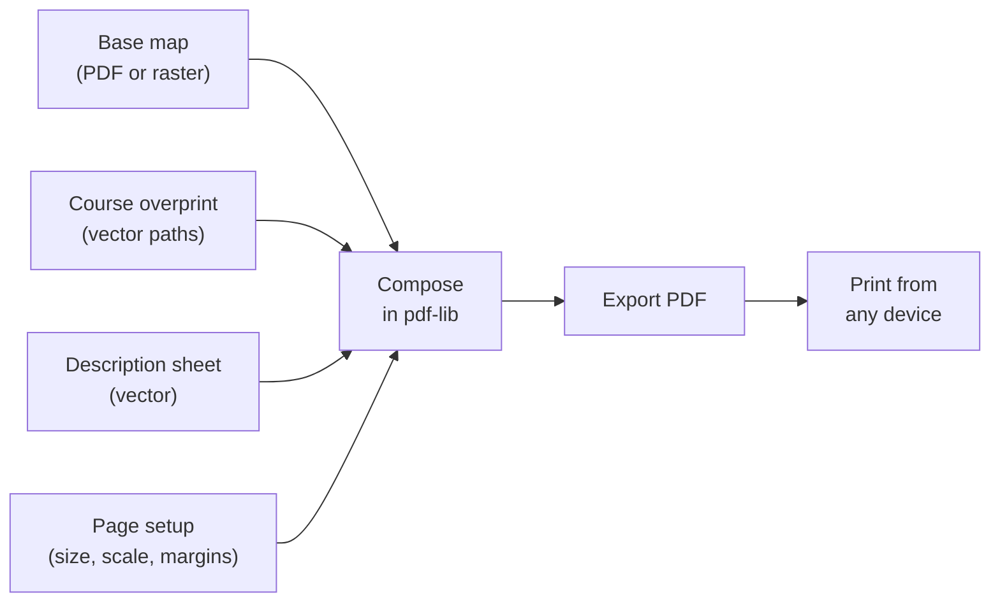

# ADR-008: PDF as Print Output with Vector Overprint

## Status
Accepted

## Context
The primary output of Overprint is a printed orienteering map with a purple course overprint. Print quality is critical — course setters produce maps for competitions where legibility directly affects the sporting outcome.

Users print from many devices (home printers, print shops, club printers) across different operating systems. We need a universally printable output format that preserves quality regardless of the print path.

Additionally, the course overprint (circles, lines, triangles, numbers) is drawn by our software, so we control how it is rendered in the output.

## Decision
Use PDF as the sole print output format, generated client-side with pdf-lib. The course overprint layer is rendered as **vector paths** in the PDF, not rasterised canvas pixels. The user configures page setup (paper size, orientation, print scale, margins) and exports a PDF, which they then print from whatever device they choose.

### Print pipeline

### Vector vs raster in the output PDF

| Layer | Rendering | Quality |
|---|---|---|
| Course overprint (purple) | Vector paths via pdf-lib | Resolution-independent — crisp at any DPI |
| Control description sheet | Vector (text, lines, symbols) | Resolution-independent |
| Base map (from PDF source) | Embed original PDF page | Preserves source quality exactly |
| Base map (from raster source) | Embed image at source resolution | Limited by input quality |

### Page setup configuration

The user configures these settings before export:

| Setting | Typical values | Notes |
|---|---|---|
| Paper size | A4, A3, Letter, custom | A4 most common for club events, A3 for long distance |
| Orientation | Portrait / Landscape | |
| Print scale | 1:10000, 1:15000, 1:4000 | Determines how much map fits on the page. 1:4000 for sprint. |
| Margins | 5–15mm | Accounts for printer non-printable area |

Print scale is independent of the map's native scale. Course setters routinely print a 1:15000 map at 1:10000 for older age classes (larger, easier to read). The overprint dimensions (circle diameter, line width, number size) are always defined at the print scale.

## Consequences

### Positive
- Vector overprint is crisp at any print resolution — no pixelation
- PDF is universally printable from any OS/device
- Embedding a PDF source map preserves the original quality end-to-end
- No server needed — pdf-lib runs entirely in the browser
- Users can share PDFs directly — no need for the recipient to have Overprint
- Description sheets as vector are trivially print-perfect

### Negative
- Raster source maps are limited by their input resolution — we cannot improve quality beyond what the user provides
- pdf-lib has some limitations with complex PDF embedding (e.g. maps with embedded fonts or transparency) that may require workarounds
- Page setup UI adds complexity to the interface

### Neutral
- This matches how PurplePen and Condes work — generate PDF, print externally
- No "print preview" in the traditional sense — the exported PDF *is* the preview

## Alternatives Considered

### Direct browser print (window.print)
Rasterises the canvas at screen resolution. Unacceptable print quality — course circles and lines would be blurry. No control over page size or margins. Rejected.

### Server-side PDF generation (e.g. Puppeteer, WeasyPrint)
Would produce good quality but violates the client-side architecture (ADR-001). Adds server dependency, hosting costs, and latency. Rejected.

### SVG export
Vector quality but not a standard print format — users would need to convert to PDF anyway. SVG has inconsistent rendering across viewers. Could be offered as a secondary export for other workflows, but not as the primary print path.

## References
- [pdf-lib documentation](https://pdf-lib.js.org/)
- [ADR-001: Client-Side Only](ADR-001) — no server dependency
- [ADR-007: pdf-lib for PDF Export](ADR-007) — library choice
- IOF overprint specifications (see `docs/iof-standards.md`)
- PurplePen PDF export as prior art
