# ADR-009: Defer OCAD Binary Format Support to Post-MVP

## Status
Accepted

## Context
OCAD is a proprietary binary file format used by the commercial OCAD mapping software. It is the most common native format for orienteering maps. PurplePen includes a full binary parser (~2000+ lines of C#) supporting OCAD versions 6–2018, handling version-specific structural differences, coordinate conversion (0.01mm units), CMYK colour definitions, encrypted files, and symbol type mapping (point, line, area, text, rectangle).

Implementing OCAD support in the browser would require either:
1. Porting the binary parser to TypeScript (~2000+ lines of complex format-specific code)
2. Compiling a C/C++/Rust parser to WebAssembly (e.g. from OpenOrienteering Mapper's OCAD reader)

Meanwhile, in practice most club-level course setters receive map files as **PDF or raster exports**, not raw OCAD files. OCAD is expensive commercial software — the people who own OCAD can export to PDF. The course setter typically receives a shared folder with map files ready to use.

## Decision
Defer OCAD binary format support entirely. Phase 0–4 support PDF and raster images only. Phase 5 introduces .omap/.xmap (OpenOrienteering Mapper) as the first native map format, since it is XML-based and parseable with standard browser APIs (JSZip + DOMParser). OCAD support is a Phase 5 stretch goal via WebAssembly.

### Phased map format support

```mermaid
gantt
    title Map Format Support Timeline
    dateFormat X
    axisFormat %s

    section Phase 0
    Raster (PNG, JPEG, TIFF, GIF)  :done, 0, 1
    PDF maps                        :done, 0, 1

    section Phase 5
    .omap/.xmap (XML in ZIP)        :active, 5, 6
    OCAD (binary via WASM)          :crit, 5, 6
```

### Why not just ask users to export to PDF?
This is the pragmatic answer for now. The one limitation: PDF exports of orienteering maps are rasterised — they lose the vector symbol definitions. For course setting purposes this is acceptable (we only need the map as a visual backdrop), but it means:
- Zooming in past the export DPI shows pixelation
- No access to individual map symbols for feature identification
- No programmatic layer toggling

These limitations are irrelevant for Phases 0–4 and acceptable for most course setters.

## Consequences

### Positive
- Removes the largest technical risk from MVP scope
- Avoids months of binary format reverse-engineering work
- PDF + raster covers the majority of real-world course setting workflows
- When OCAD support is added via WASM, it will be higher quality than a hand-rolled TypeScript parser

### Negative
- Power users who work directly with OCAD files must export to PDF first (extra step)
- Cannot offer "round-trip" OCAD support (load OCAD → set course → export back to OCAD)
- Marketing: cannot claim "supports OCAD files" until Phase 5

### Neutral
- PurplePen's OCAD parser is open source (C#) and well-documented — it remains available as a reference when we do implement this
- OpenOrienteering Mapper's C++ OCAD reader is a WASM compilation candidate
- The OCAD format spec documents are in PurplePen's repo at `doc/devdocs/OCAD9Format.txt` and `OCAD10Format.txt`

## Alternatives Considered

### Port PurplePen's C# parser to TypeScript
~2000+ lines of binary format handling with version-specific quirks. High effort, high maintenance burden, and we'd need to keep it updated as new OCAD versions release. Rejected for MVP.

### Server-side OCAD conversion
Would break ADR-001 (client-side architecture). Adds backend dependency. Rejected.

### WASM from day one
Technically possible but adds build complexity (Rust/C++ toolchain, WASM bundling in Vite) to the MVP when PDF covers the use case. Better to add this when the foundation is solid and we have real user demand. Deferred, not rejected.

## References
- [PurplePen OCAD parser](https://github.com/petergolde/PurplePen) — `src/MapModel/MapModel/OcadImport.cs`
- [OpenOrienteering Mapper OCAD reader](https://github.com/OpenOrienteering/mapper) — C++ implementation
- PurplePen format specs: `doc/devdocs/OCAD9Format.txt`, `OCAD10Format.txt`
- [ADR-001: Client-Side Only](ADR-001) — no server dependency
