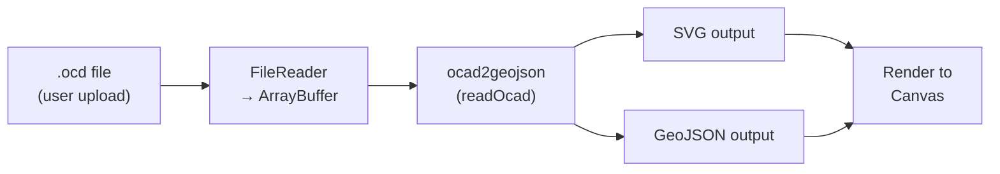

# ADR-010: OCAD Support via ocad2geojson in Phase 1

## Status
Accepted — supersedes [ADR-009](ADR-009-defer-ocad-support.md)

## Context
ADR-009 deferred OCAD binary format support to Phase 5, assuming it required either porting ~2000 lines of C# or building a custom WASM module. This was a reasonable assumption at the time, but it was wrong.

Two things have changed:

1. **`ocad2geojson` exists.** Per Liedman's JavaScript library ([perliedman/ocad2geojson](https://github.com/perliedman/ocad2geojson)) is an actively maintained (last release November 2025), browser-compatible OCAD parser supporting versions 10–2018. It outputs GeoJSON and SVG — both directly usable as map backdrops. The hard work of binary format parsing is already done.

2. **Real user behaviour disproves "just export to PDF".** The first file Jim reached for when testing was a `.ocd` file. PurplePen users work with OCAD files daily — asking them to export to PDF first adds friction and loses vector quality. If we want PurplePen users to try Overprint, we need to accept their files.

## Decision
Bring OCAD file support forward from Phase 5 to **Phase 1** (map loading), using `ocad2geojson` as a client-side dependency.

### How it works

- User selects a `.ocd` file via the file picker
- `FileReader` reads it as an `ArrayBuffer`
- `ocad2geojson.readOcad(buffer)` parses the binary format entirely client-side
- The library outputs SVG (for visual rendering) and/or GeoJSON (for geometry)
- We render the SVG to the map canvas as the base layer

This stays fully client-side (ADR-001), requires no WASM toolchain, and adds a single well-maintained dependency.

### OCAD version support
`ocad2geojson` supports OCAD versions 10, 11, 12, and 2018. Older versions (6–9) are not supported but are increasingly rare in active use. This covers the vast majority of maps in circulation.

### Licence
Both `ocad2geojson` and Overprint are licensed AGPL-3.0 — no licence tension. See [licence reference](../reference/agpl-dependency-licence.md) for details on what AGPL-3.0 means in practice.

### Phased map format support (revised)

```mermaid
gantt
    title Map Format Support Timeline
    dateFormat X
    axisFormat %s

    section Phase 0
    Raster (PNG, JPEG, GIF)         :done, 0, 1

    section Phase 1
    PDF maps (via PDF.js)            :active, 1, 2
    OCAD files (via ocad2geojson)    :active, 1, 2

    section Phase 5
    .omap/.xmap (XML in ZIP)         :5, 6
```

## Consequences

### Positive
- PurplePen users can load their existing OCAD maps directly — zero friction
- No binary parser to write or maintain — `ocad2geojson` handles format quirks
- Stays fully client-side (no WASM build complexity, no server dependency)
- SVG output gives vector-quality map rendering with clean zoom
- GeoJSON output provides structured geometry if we need it later (e.g. layer toggling)
- Maintained by Per Liedman, a respected contributor to the orienteering open-source ecosystem

### Negative
- AGPL-3.0 copyleft means forks must also be open-source (this is intentional, not a downside for this project)
- OCAD versions 6–9 not supported (acceptable — these are legacy)
- Rendering fidelity may not be pixel-perfect compared to OCAD's own renderer (acceptable for a course-setting backdrop)
- Adds a dependency on a third-party library — if it becomes unmaintained, we'd need to fork or replace

### Neutral
- The WASM approach from ADR-009 remains a valid future option if we need deeper OCAD support (e.g. full symbol editing, round-trip save)
- `ocad2geojson` is itself open source — we can contribute fixes upstream or fork if needed

## Alternatives Considered

### Keep ADR-009 (defer to Phase 5)
The original plan. Now clearly wrong — a working JS parser exists and user behaviour shows OCAD support is table-stakes, not a nice-to-have.

### Server-side conversion service
Upload `.ocd` → return SVG/PDF. Breaks ADR-001 (client-side architecture), adds hosting cost and latency, creates a backend dependency. Rejected.

### WASM from C++/Rust
No existing WASM builds of OCAD parsers exist today. Building one from OpenOrienteering Mapper's C++ reader would be a multi-week effort with build toolchain complexity. Unnecessary when `ocad2geojson` works in pure JS. Rejected for now; remains a future option for deeper format support.

### Port PurplePen's C# parser to TypeScript
~2000+ lines of binary format handling. High effort, redundant with `ocad2geojson`. Rejected.

## References
- [ocad2geojson on GitHub](https://github.com/perliedman/ocad2geojson) — the library we'll use
- [ocad2geojson on npm](https://www.npmjs.com/package/ocad2geojson)
- [OCAD Converter web demo](https://www.liedman.net/ocad2geojson/) — Per Liedman's demo showing browser-based OCAD rendering
- [ADR-009](ADR-009-defer-ocad-support.md) — the decision this supersedes
- [ADR-001: Client-Side Only](../architecture.md#adr-001-client-side-only-long-term-architecture)
- [AGPL-3.0 licence analysis](../reference/agpl-dependency-licence.md)
