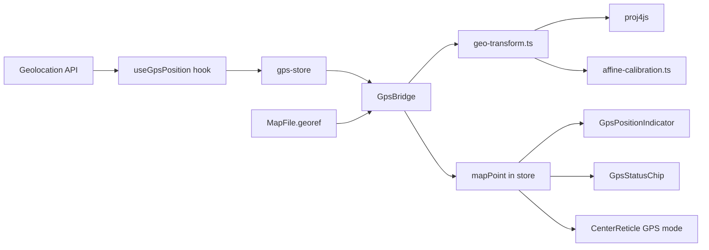

# ADR-012: GPS-Based Control Placement

**Status:** Accepted
**Date:** 2026-03-21

## Context

Orienteering course setters work in the field with a phone or tablet. Placing controls accurately requires walking to the feature and estimating position on the map visually. GPS positioning can eliminate this guesswork by mapping the device's real-world location to a position on the map.

This requires: (1) the map to be georeferenced (knowing the relationship between map pixels and real-world coordinates), and (2) a coordinate transformation pipeline to convert GPS lat/lon to map pixel positions.

## Decision

Implement GPS control placement using the browser Geolocation API and proj4js for coordinate transforms.

### Architecture

### Transform Pipeline

Two paths depending on georef source:

**OCAD/OMAP maps** (auto-extracted georef):
GPS WGS84 → proj4 → projected CRS → subtract ref point → scale to paper units → grivation rotation → viewBox transform → pixels

**Calibration** (manual 2-3 point registration):
GPS WGS84 → proj4 → projected CRS → affine transform → pixels

### Key Choices

- **proj4js** over simpler approaches: handles all CRS projections including Australian GDA94/GDA2020, UTM zones, and arbitrary PROJ.4 strings from OMAP files. ~150KB gzipped but only loaded when GPS is used.
- **Affine calibration** for raster maps: 2 points use independent-axis linear interpolation (avoids similarity transform rotation ambiguity); 3+ points use full least-squares affine.
- **Ephemeral GPS store** separate from event store: GPS state is not saved, not undoable, and has its own lifecycle.
- **Screen Wake Lock API**: keeps screen on during field use (iOS 16.4+, Chrome 84+).
- **Page visibility handling**: stops GPS when tab hidden, restarts when visible (battery conservation).

## Consequences

- New runtime dependency: `proj4@2.20.4` (~150KB gzipped)
- GeoReference type added to MapFile (persists in .overprint JSON)
- Australian EPSG codes (GDA94/GDA2020 MGA zones 49-56) pre-registered at module load
- HTTPS required for Geolocation API on non-localhost origins (added `@vitejs/plugin-basic-ssl` for dev)

## References

- [GPS Control Placement Plan](../plans/gps-control-placement.md)
- [GPS UX Specification](../gps-control-placement-ux-spec.md)
