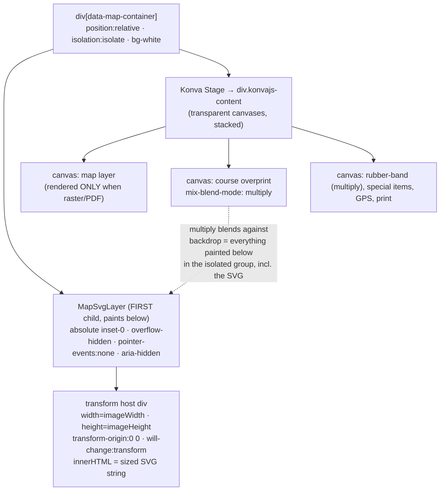

# ADR-015: Live DOM-SVG Map Layer for Vector Maps

## Status

**Proposed** — pending a Phase 0 Safari/iOS spike (see "Decision gate"). This is roadmap item **#3** in the map-render-fidelity effort; items #1 (adaptive re-rasterization) and #2 (device-aware DPI ceiling) shipped and remain the interim/fallback path.

## Context

Overprint flattens every map — OCAD `.ocd`, OpenOrienteering `.omap/.xmap`, PDF, raster — to a single bitmap drawn as one `KonvaImage`, then scales that bitmap up to 10× on zoom. Detail blurs on zoom because a raster is being magnified. PurplePen never rasterizes: it keeps a live vector model and repaints at screen resolution every frame, so it is sharp at every zoom.

#1/#2 mitigate the blur by re-rasterizing the vector source at higher density (capped ~8192px) when zoom settles. That is a ceiling, not infinity — desktop gains ~2×, and there is a transient blur-then-settle. To reach true PurplePen sharpness for **vector** maps, the map must render as **live vector**, not a bitmap.

Both loaders already retain a sized-less SVG string (`load-ocad.ts`, `load-omap.ts` → `LoadOcadResult.svg` / `LoadOmapResult.svg`, stored as `map-image-store` `rerender: { kind: 'svg', svg }`). #3 renders that SVG string directly in the DOM, live, instead of only using it to re-rasterize.

## Decision (proposed)

Render the loader SVG as an absolutely-positioned, `pointer-events: none` `<svg>` host that is the **first child** of the map container (painting *below* the Konva Stage), CSS-transformed to track the Stage's pan/zoom every frame. The Konva Stage keeps rendering the overprint/course/special-items/GPS layers on transparent canvases on top. **Vector maps (ocad/omap) → DOM SVG. Raster + PDF maps → existing Konva image layer + #1 adaptive raster (unchanged).**

This is **display-only**. Coordinate space, controls, georef/GPS/calibration, export, and print are untouched.

### DOM structure

### Transform sync

The Stage is uncontrolled by design (gestures mutate `stage.scale()/position()` imperatively and only debounce to `viewport-store` — see `use-map-navigation.ts`, to avoid iOS pinch bounce-back). A DOM layer synced to the **store** would lag up to 100 ms per frame and stutter during gestures. Instead, sync to the **Stage node**:

- **Primary:** subscribe to Konva attr-change events — `stage.on('xChange yChange scaleXChange', …)` — and write `host.style.transform = translate(x,y) scale(k)` synchronously. Every movement path (gesture, wheel, keyboard, store-subscriber, fit-to-view, dbl-tap) goes through those setters, so this covers 100% of motion with one source of truth and no idle loop.
- **Fallback if a 1-frame skew ever shows on low-end devices:** move the style write into the same `requestAnimationFrame` as Konva's `batchDraw` (read live `getStageInstance()` transform per frame).

The invariant matches Konva exactly: `screen = map_px × zoom + pan`, `transform-origin: 0 0`.

### Coordinate alignment — RESOLVED

The stored SVG carries only its native `viewBox`; the host injects `width=imageWidth height=imageHeight` (the same values the base bitmap uses, `image.naturalWidth/Height = round(viewBox × renderScale)`). A map-unit point therefore maps to the identical pixel it maps to in the current bitmap, so the SVG registers **1:1 with control coordinates** — by construction, identical to today's raster. No coordinate code changes. (This was the one open "must-verify" flag from review; confirmed from the loader math — the Phase 0 spike double-checks it visually.)

## The multiply-blend coupling (make-or-break)

The course + rubber-band Konva canvases carry `mix-blend-mode: multiply` (`map-canvas.tsx` ~L200) so dark map features show through the purple overprint. `mix-blend-mode` blends against the **backdrop** — everything painted below within the nearest **isolated** group.

Walking the ancestor chain from the multiply canvas: neither `konvajs-content` (`position:relative`, no isolating property) nor `data-map-container` currently forms an isolating stacking context. So the backdrop already extends to siblings painted below the Stage — a sibling SVG host qualifies. `transform`/`will-change` on the SVG *wrapper* makes the wrapper its own stacking context (paints atomically) but does **not** remove it from the canvas's backdrop. **Per spec, the blend works with the SVG behind the canvas.** We add `isolation: isolate` on the container to bound the blend group deliberately and future-proof against an ancestor gaining a stacking context.

**Real risk — Safari/iOS.** WebKit has a history of `mix-blend-mode` breaking/flickering when the blending element is an accelerated `<canvas>` and the backdrop is a separately GPU-composited layer — which `will-change: transform` on a per-frame-transformed SVG forces. Chrome/Firefox are fine. This is the single gating unknown and **must be prototyped on real iOS Safari before any refactor.**

## Decision gate — Phase 0 spike (½ day, throwaway)

Hardcode a fixture SVG behind the Stage in dev and verify on **Chrome, Firefox, Safari, iOS Safari**:

1. Multiply blend renders correctly (dark map line under a purple circle → multiplied colour, not flat purple).
2. Gesture sync via attr events stays glued (no lag/skew map↔overprint) through pinch/wheel/pan.
3. Initial parse+paint time on the largest OCAD fixture is acceptable (< ~500 ms), and 1:1 alignment is visually exact.

**If iOS blend fails:** try dropping `will-change` on Safari (accept per-frame repaint; WebKit's SVG rasterizer is fast). If it still fails, ship vector maps via the existing #1 raster path behind a per-browser flag — the escape hatch already exists in shipped code. The spike outcome decides whether this ADR moves to Accepted.

### Phase 0 spike results (2026-08-06)

Built behind `?svgmap=1` (`map-svg-layer.tsx`, `use-svg-transform-sync` via Konva attr events, commit `c26f117`). Verified on **Chrome** with the Mt Taylor OCAD fixture:

- ✅ **Live SVG renders razor-sharp** — 1874 nodes; at 3× zoom every contour, dot-screen and cliff symbol is crisp vector, zero blur (vs. the bitmap's upscale blur). This is the target quality.
- ✅ **Transform stays glued** — the host `transform` matched the stage exactly through zoom-button steps *and* direct `stage.scale/position` mutation (attr-event sync works on every path, including imperative gesture mutation).
- ✅ **1:1 alignment** — a placed control sits on the correct map feature; scale bar / text crisp.
- ✅ **KonvaImage suppressed** in SVG mode; **container `isolation: isolate`** applied; SVG is first child.
- ✅ **Overprint composites over the SVG**, zero console errors.
- ⚠️ **Bug found & fixed (unrelated to #3):** the overprint `mix-blend-mode: multiply` was **not being applied at all** in the current build — the blend effect's empty-deps ran before the Stage mounted (size measured async) and never re-ran. Fixed in commit `9081243` (re-run once size is non-zero + on map load). This was a latent bug in shipped v0.19.0, surfaced by the spike.
- ❌ **iOS Safari blend — FAILS (tested 2026-08 on a real iPhone).** The DOM-SVG map renders correctly and the overprint aligns and does not crash, but the `mix-blend-mode: multiply` does **not** composite against the SVG — the purple overprint renders **flat/opaque** (bright magenta over a bright-green field, where multiply would give a dark olive). This is the predicted WebKit bug: the SVG, promoted to its own GPU-composited layer by the per-frame CSS `transform` (and `will-change`), leaves the multiply canvas's backdrop → multiply blends against white, i.e. no-op. Desktop/Chrome is unaffected (multiply verified there).

### Decision from the spike

- **Desktop / non-Safari:** DOM-SVG (#3) is viable — ship it there.
- **iOS / Safari:** fall back to the shipped **#1 adaptive-raster** path (map + overprint are same-context Konva canvases, so multiply already works and sharpness is already good). Detect via the existing `raster-config` iOS check / a Safari UA test.
- **Optional experiment before committing the fallback:** drop `will-change: transform` on Safari and re-test on-device — if the SVG stays in the multiply backdrop, the blend may work and iOS could keep true vector. Only fall back if that fails too.
- Nothing shipped is affected — the spike is opt-in behind `?svgmap=1`.

Status remains **Proposed** until Phase 1 lands the non-Safari DOM-SVG path with the Safari fallback.

## Implementation phases (post-gate)

- **Phase 1 — core.** New `map-svg-layer.tsx` + `use-svg-transform-sync.ts`; `useDomSvgMap = rerender?.kind === 'svg' && !svgLayerDisabled` predicate; render `KonvaImage` only when `!useDomSvgMap`; early-return in `use-adaptive-map-raster` for the svg kind; `isolation:isolate` + `bg-white` on the container. Inject SVG via `innerHTML` in an effect keyed on `mapVersion` (never through React diffing of the multi-MB subtree).
- **Phase 2 — hardening.** Safari/size fallback flag; SVG sanitize pass at load (strip `pointer-events`, no filters/masks); Playwright screenshot tests for blend + alignment at 3 zoom levels across mobile/tablet/desktop; memory profile on the largest fixture.
- **Phase 3 (only if profiling demands).** Per-`<g>` `content-visibility: auto` / viewport culling; user-facing "vector rendering" toggle in map settings.

## What stays unchanged

- **Store keeps the base bitmap** (`image`) even for vector maps — consumed by export, thumbnails, and the raster fallback. No un-rasterizing of loaders is required; the live SVG is an *additional* consumer of the string the store already holds. (Corrects a review assumption that #3 needs the loaders to stop rasterizing.)
- **Export/print.** PDF export reads the store bitmap / original PDF bytes; unaffected. PNG/JPEG export (`toolbar.tsx` `handleExportImage`) hand-composites layer canvases because Konva ignores CSS blend modes — it gains one step: rasterize the live SVG first (reuse `rasterizeSvgToImage`) then draw the multiply layers over it. This is why the store retains both representations.
- **Overprint stays in Konva.** Do NOT move course/overprint layers to DOM/SVG — it would double the sync + blend problems and forfeit Konva hit-testing, drag, and the whole `CourseRenderer` stack for no benefit.
- Georef/GPS/calibration, `.overprint` save/load, IOF XML, ppen import, `getStageInstance()` consumers, fit-to-view, zoom controls, print boundary, center reticle.

## Risks (ranked)

1. **Safari `mix-blend-mode` over CSS-transformed SVG** — HIGH likelihood of *some* WebKit quirk, LOW cost (escape hatch = shipped #1 path). Phase 0 answers it in hours.
2. **Initial parse/paint jank on very large OCAD files** — MEDIUM. Keep base bitmap visible until the SVG's first paint (swap after one rAF); size circuit-breaker → raster fallback above a node/byte threshold.
3. **1-frame transform skew map↔overprint** — LOW. Attr-event sync is synchronous with every mutation; escalate to shared-rAF write if needed. Alignment screenshot test guards it.
4. **Konva internals drift** (`konvajs-content` styling, attr-event names) — LOW; both long-stable. The codebase already accepts this class of coupling (`_canvas` access).
5. **Composited-layer memory on huge zoomed maps** — LOW; tiles are viewport-bounded. Drop `will-change` past a zoom threshold if needed.

## Test exposure

Near-zero existing coverage on the touched code: only `load-omap.test.ts` (pure `_coordsToPath`) and `use-map-navigation.test.ts` (`fitToView` math). `map-canvas.tsx`, `map-image-store.ts`, and the loader dispatch have no tests — so Phase 2 adds Playwright screenshot tests (blend + alignment) as the real safety net.

## References

- Roadmap + interim work: `use-adaptive-map-raster.ts`, `raster-config.ts`, `rasterize-svg.ts` (#1/#2).
- Loaders producing the SVG: `load-ocad.ts`, `load-omap.ts`.
- Blend + stage plumbing: `map-canvas.tsx` (container ~L388, map layer ~L423, blend ~L200), `use-map-navigation.ts` (imperative transform paths), `map-image-store.ts` (`rerender`).
