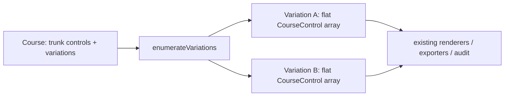

# ADR-017: Course Variations (Forks / Gaffling)

## Status

**Accepted** and implemented for **Phase 1 — forks/gaffling** (v0.25.0) and **Phase 2 —
butterfly/phi loops + IOF interop** (v0.26.0). **Proposed** for Phase 3 (relay team assignment),
which the model is deliberately designed to accommodate. Resolves conformance-plan §6 item 10
(the largest remaining structural gap).

### Phase 2 (loops) — what the design predicted, and held

The `kind:'loop'` seam slotted in with no pipeline rewrite, exactly as intended:

- **Enumerator** — a loop's dimension is `k!` (permutations of loop order via `nthPermutation`,
  a factorial-number-system unranker) instead of a fork's `k` branch choices. Flattening emits the
  hub (anchor) **k+1 times** — before each loop and once on departure — so one physical circle
  carries k+1 sequence numbers; `numberOffset`/`score` are stripped on hub copies so the renderer's
  fan isn't defeated by a user's trunk-hub number drag. `courseControlId` is therefore **not unique
  within a variation** (all hub copies share the trunk anchor's id) — codified as an invariant;
  nothing keys a flattened variation by it.
- **Renderers** — repeated hubs forced unique React keys (`${control.id}-${index}`, `leg-${i}`) and
  a shared pure `computeNumberFanOffsets` (`core/geometry/number-fan.ts`) used by **both** the screen
  and PDF renderers (map-pixel delta space → identical geometry). A pre-existing filtered-vs-unfiltered
  leg-index bug was fixed at the same time by carrying the source `CourseControl` on each resolved entry.
- **IOF interop** — IOF XML v3 has no native fork/loop element, so (matching PurplePen) each variation
  exports as a separate `<Course>` grouped by `<CourseFamily>` (base course name), code in `<Name>`.
  Import reads `CourseFamily` but keeps variations as separate flat courses (no reconstruction; the
  `.overprint` format is the lossless round-trip). A 5-loop hub (5! = 120 > `MAX_VARIATIONS`) surfaces a
  visible truncation toast on export rather than silently dropping team variations.
- **Guards** — a loop needs ≥2 loops (`tooFewLoops`); >4 is a soft legibility warning (`tooManyLoops`);
  at most one generator per anchor (`duplicateAnchor`, enforced in the store and the enumerator).

## Context

A `Course.controls` is a **flat linear array**: sequence = array index, leg *i* runs
`controls[i-1] → controls[i]`, and leg geometry (`bendPoints`/`legGaps`) is stored on the *source*
`CourseControl`. This has no branch model, so **forked/gaffled** courses (different runners get
different variations of the same course) and relays were impossible — and ~15 consumers
(renderer, descriptions, length, audit, every exporter) assume that flat-linear shape.

## Decision

**Represent forks as extra data on the `Course`, and enumerate them into concrete linear
variations that the existing linear consumers eat unchanged** — the same reuse pattern multi-part
(map-exchange) courses already use (`course-parts.ts` + the synthetic-course
`{ ...course, controls: <slice> }`). No rewrite of the linear consumers.

Key model decisions (`src/core/models/types.ts`, `src/utils/id.ts`):

- **Anchor by a stable per-occurrence `CourseControlId`, not `ControlId`.** A control can recur
  (loops revisit it; gaffles share controls across branches), so anchoring by `ControlId` is
  ambiguous. `CourseControl.courseControlId` is optional at the type level but **guaranteed on
  every stored control** by the store (creation) and load-migration (backfill).
- **`Course.variations?: CourseFork[]`** — absent for simple courses (unchanged on disk).
  `CourseFork = { id, kind:'fork', anchorCourseControlId, branches }`; a `ForkBranch` has a sticky
  `label` (variation codes derive from labels, not array position), its own `controls`, and its
  own **entry-leg geometry** (`entryBendPoints`) — held on the branch, not the shared anchor,
  because each branch leaves the anchor differently. The enumerator copies it onto a fresh anchor
  copy per variation; the trunk anchor is never mutated.
- **`kind` is a union** so `kind:'loop'` (butterfly/phi) adds in Phase 2 via the enumerator's
  per-fork choice set rather than a parallel pipeline.

Enumerator (`src/core/models/variation-enumerator.ts`, pure): cartesian product of branch choices,
deterministic (mixed-radix, forks ordered by anchor index), `MAX_VARIATIONS = 100` cap with a
`truncated` flag, and **defensive** — a fork whose anchor is unresolvable/first/last is dropped
(never throws or splices at −1), so a stale `variations` written by an older cached SPA degrades
gracefully. `variationCourse(course, v)` returns the **original object** for the no-fork case,
guaranteeing byte-identical output for unforked courses.

Store, exports, UI all route through the enumerator: `forEachCourseControl` guards orphan-cleanup /
audit / move-all so branch controls aren't corrupted; PDF/description/IOF/audit run **per
variation** (variation-outer, part-inner); the course panel's Variations section edits forks and a
picker drives the on-canvas variation preview. Branch editing is via `(forkId, branchId)` store
actions; the flattened variation view is read-only on canvas in Phase 1 (index-based leg edits are
disabled there to avoid trunk corruption).

## Consequences

- Forks and loops work end-to-end (create, enumerate, preview, export) with zero change to unforked courses.
- **Deferred:** variation-specific rejoin points (branches rejoining at *different* trunk controls);
  spider-from-start / finish-as-hub loops (the hub must be an interior *normal* control — a start
  triangle or finish rendered k+1× would be wrong; workaround: place a normal control at the start as
  the hub); a fork *inside* a loop (the model doesn't structurally forbid it); relay team assignment
  (Phase 3). Map-exchange inside/at a loop is forbidden as an implementation simplification, **not** an
  IOF rule. OMAP/GPX exports still emit only the trunk (they don't enumerate variations) — a documented
  gap tracked for a follow-up.
- **Phase-3 framing note (from domain review):** permuting loop order is for **anti-following /
  hub-congestion**, not distance-balancing — with comparable loops the total distance/climb is equal by
  construction. The real fairness check is a future loop-length-imbalance audit, not order assignment.
- Adversarial reviews (architecture + orienteering-domain) shaped the model up front for both phases —
  see the plan and conformance-plan §6.10.
