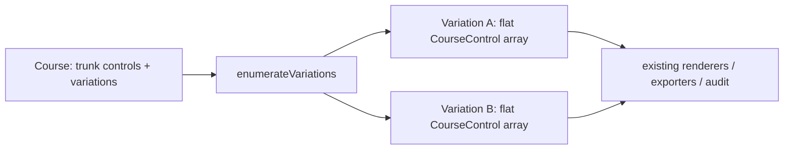

# ADR-017: Course Variations (Forks / Gaffling)

## Status

**Accepted** and implemented for **Phase 1 — forks/gaffling** (shipped v0.25.0). **Proposed**
for Phase 2 (butterfly/phi loops + IOF fork XML round-trip) and Phase 3 (relay team assignment),
which the model is deliberately designed to accommodate. Resolves conformance-plan §6 item 10
(the largest remaining structural gap).

## Context

A `Course.controls` is a **flat linear array**: sequence = array index, leg *i* runs
`controls[i-1] → controls[i]`, and leg geometry (`bendPoints`/`legGaps`) is stored on the *source*
`CourseControl`. This has no branch model, so **forked/gaffled** courses (different runners get
different variations of the same course) and relays were impossible — and ~15 consumers
(renderer, descriptions, length, audit, every exporter) assume that flat-linear shape.

## Decision

**Represent forks as extra data on the `Course`, and enumerate them into concrete linear
variations that the existing linear consumers eat unchanged** — the same reuse pattern multi-part
(map-exchange) courses already use (`course-parts.ts` + the synthetic-course
`{ ...course, controls: <slice> }`). No rewrite of the linear consumers.

Key model decisions (`src/core/models/types.ts`, `src/utils/id.ts`):

- **Anchor by a stable per-occurrence `CourseControlId`, not `ControlId`.** A control can recur
  (loops revisit it; gaffles share controls across branches), so anchoring by `ControlId` is
  ambiguous. `CourseControl.courseControlId` is optional at the type level but **guaranteed on
  every stored control** by the store (creation) and load-migration (backfill).
- **`Course.variations?: CourseFork[]`** — absent for simple courses (unchanged on disk).
  `CourseFork = { id, kind:'fork', anchorCourseControlId, branches }`; a `ForkBranch` has a sticky
  `label` (variation codes derive from labels, not array position), its own `controls`, and its
  own **entry-leg geometry** (`entryBendPoints`) — held on the branch, not the shared anchor,
  because each branch leaves the anchor differently. The enumerator copies it onto a fresh anchor
  copy per variation; the trunk anchor is never mutated.
- **`kind` is a union** so `kind:'loop'` (butterfly/phi) adds in Phase 2 via the enumerator's
  per-fork choice set rather than a parallel pipeline.

Enumerator (`src/core/models/variation-enumerator.ts`, pure): cartesian product of branch choices,
deterministic (mixed-radix, forks ordered by anchor index), `MAX_VARIATIONS = 100` cap with a
`truncated` flag, and **defensive** — a fork whose anchor is unresolvable/first/last is dropped
(never throws or splices at −1), so a stale `variations` written by an older cached SPA degrades
gracefully. `variationCourse(course, v)` returns the **original object** for the no-fork case,
guaranteeing byte-identical output for unforked courses.

Store, exports, UI all route through the enumerator: `forEachCourseControl` guards orphan-cleanup /
audit / move-all so branch controls aren't corrupted; PDF/description/IOF/audit run **per
variation** (variation-outer, part-inner); the course panel's Variations section edits forks and a
picker drives the on-canvas variation preview. Branch editing is via `(forkId, branchId)` store
actions; the flattened variation view is read-only on canvas in Phase 1 (index-based leg edits are
disabled there to avoid trunk corruption).

## Consequences

- Forks work end-to-end (create, enumerate, preview, export) with zero change to unforked courses.
- **Deferred:** variation-specific rejoin points (branches rejoining at *different* trunk
  controls) are not expressible in Phase 1; loops and relay team assignment are Phase 2/3.
- Two adversarial reviews (architecture + orienteering-domain) shaped the model up front — see the
  plan and conformance-plan §6.10.
