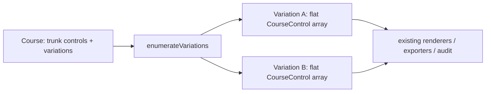

# ADR-017: Course Variations (Forks / Gaffling)

## Status

**Accepted** and implemented for **Phase 1 — forks/gaffling** (v0.25.0), **Phase 2 —
butterfly/phi loops + IOF interop** (v0.26.0), and **Phase 3 — relay team assignment** (v0.27.0).
Resolves conformance-plan §6 item 10 (the largest remaining structural gap).

### Phase 3 (relay team assignment) — what shipped

A relay assigns each (team, leg) cell a specific variation so a mass-started field splits up and no
team can follow another. `RelaySettings { firstTeamNumber, teams, legs }` lives on `Course.relay`
(plain numbers → round-trips through the whole-event JSON with no branded-id restore; copied in
`duplicateCourse`; auto-undoable via the `{ event }` temporal partialize). The assignment itself is
**computed on demand**, never stored.

- **Faithful port of PurplePen's `RelayVariations`** (`relay-assignment.ts`), adapted from PP's
  recursive fork TREE to Overprint's FLAT generator list. PP's per-fork scoring has no cross-fork
  interaction term, so a leg assignment is just a **choice vector** (branch index per fork,
  permutation rank per loop) — identical to an enumerated `Variation`, so grid codes are byte-identical
  to the Variations picker (shared `resolveGenerators` / `variationCode` / `choiceVectorToVariation`,
  extracted from the enumerator). The greedy generator (seeded mulberry32, best-of-100 team selection,
  budgeted best-of-N per leg, 3-part anti-following score) is ported verbatim, including these
  **faithful quirks**: loops are excluded from cross-team branch-following (Check 1); the ×3
  "first generator" boost is consumed even by a leading loop; per-fork branch usage within a team is a
  hard multiset (`floor(L/k)` + bias to the first `L%k` branches). `minUniquePathsByLeg` collapses to
  `totalVariations` — **provably exact** for the flat, unpinned model (must become per-leg if fixed
  branch pinning ships).
- **Determinism is within-Overprint only** — a fixed seed makes runs reproducible across
  runs/platforms, but a different PRNG family means it is NOT bit-identical to PurplePen; a `.ppen` and
  Overprint will never produce the same grid (they never could).
- **Not bound by `MAX_VARIATIONS`** — the assignment builds choice vectors directly and the export
  decodes them with the uncapped `choiceVectorToVariation`, so a course with > 100 combinations still
  resolves every assigned cell's `<Course>`.
- **UI** — a "Relay teams…" modal (`relay-modal.tsx`, launched from the Variations section via a
  `tool-store` flag, mounted from the toolbar) with teams/legs inputs, a team × leg grid, uneven-division
  warnings, a duplicate-teams note, and export buttons.
- **Export** — a self-contained IOF XML v3 `CourseData` (`export-relay-xml.ts`): `Map` → `Control*` →
  `Course*` (one per uncapped variation, `CourseFamily`-grouped) → `TeamCourseAssignment*` (native IOF
  relay elements; `Leg` 1-based; `CourseName` = `"<course> <code>"` referencing the variation courses)
  in strict schema order; plus a paginating team × leg PDF table (`pdf-relay-table.ts`).
### Phase 3b (fixed branch→leg pinning) — v0.28.0

Setters can now force specific legs to run a specific fork branch (PP `FixedBranchAssignments`).
`RelaySettings.fixedBranches: Record<BranchId, number[]>` (BranchId → 0-based leg indices; loops are
never pinned — no branch choice). Keyed by the stable `BranchId` (labels aren't globally unique in the
flat model). Round-trips verbatim.

- **`minUniquePathsByLeg` is now genuinely per-leg** (the Phase 3 documented expiry): a fork contributes
  1 for a pinned leg, `numNonFixed` otherwise, `k!` for a loop. With no pins `numNonFixed = k` ⇒ product
  = `totalVariations` for every leg, byte-identical to Phase 3 (golden snapshots are the regression anchor).
- **Contradictory-pin semantics (PP, load-bearing):** if a fork ends fully pinned yet a leg is unpinned,
  that leg has no branch to run — so the fork's *entire* pin set is dropped (runs unpinned) and a
  `legUnassignable` issue is surfaced. This guarantees the invariant `numNonFixed ≥ 1` OR all legs pinned,
  keeping the branch pool non-empty and `minUnique ≥ 1` (avoids empty-pool `undefined` codes / `0/0` NaN
  scoring). Other invalid pins (out-of-range leg, stale/unknown BranchId, a leg pinned twice in one fork)
  are dropped-and-warned, never blocking — matching PP's `ValidateFixedBranches` + Overprint's defensive
  philosophy.
- A fixed leg **preserves** the ×3 first-generator boost (PP skips a fixed leg before `firstFork=false`),
  unlike a loop which consumes it.
- **UI:** an inline branch × leg toggle matrix in the Relay modal (`overflow-x-auto`, sticky branch
  column), gated on `teams > 0` and ≥1 fork; pins via `toggleRelayFixedLeg` (one branch per leg per fork,
  enforced at write time). **Store hygiene:** `duplicateCourse` **remaps** pins onto the clone's
  regenerated BranchIds (a deep copy alone would orphan them); `setRelaySettings` drops now-out-of-range
  pins on a legs-reduce as a *stored* mutation (no reduce→increase resurrection); `removeBranch`/`removeFork`
  eager-clean orphaned pins.

- **Deferred still**: cross-team first-loop spreading at a butterfly hub (a gap PP shares); importing
  `.ppen` relay/fixed-branch settings; drawing variation-code letters on the map.

### Phase 2 (loops) — what the design predicted, and held

The `kind:'loop'` seam slotted in with no pipeline rewrite, exactly as intended:

- **Enumerator** — a loop's dimension is `k!` (permutations of loop order via `nthPermutation`,
  a factorial-number-system unranker) instead of a fork's `k` branch choices. Flattening emits the
  hub (anchor) **k+1 times** — before each loop and once on departure — so one physical circle
  carries k+1 sequence numbers; `numberOffset`/`score` are stripped on hub copies so the renderer's
  fan isn't defeated by a user's trunk-hub number drag. `courseControlId` is therefore **not unique
  within a variation** (all hub copies share the trunk anchor's id) — codified as an invariant;
  nothing keys a flattened variation by it.
- **Renderers** — repeated hubs forced unique React keys (`${control.id}-${index}`, `leg-${i}`) and
  a shared pure `computeNumberFanOffsets` (`core/geometry/number-fan.ts`) used by **both** the screen
  and PDF renderers (map-pixel delta space → identical geometry). A pre-existing filtered-vs-unfiltered
  leg-index bug was fixed at the same time by carrying the source `CourseControl` on each resolved entry.
- **IOF interop** — IOF XML v3 has no native fork/loop element, so (matching PurplePen) each variation
  exports as a separate `<Course>` grouped by `<CourseFamily>` (base course name), code in `<Name>`.
  Import reads `CourseFamily` but keeps variations as separate flat courses (no reconstruction; the
  `.overprint` format is the lossless round-trip). A 5-loop hub (5! = 120 > `MAX_VARIATIONS`) surfaces a
  visible truncation toast on export rather than silently dropping team variations.
- **Guards** — a loop needs ≥2 loops (`tooFewLoops`); >4 is a soft legibility warning (`tooManyLoops`);
  at most one generator per anchor (`duplicateAnchor`, enforced in the store and the enumerator).
- **Authoring (v0.26.1)** — the branch/loop "+ control" picker offers every *real* control in the event
  (start/finish/exchange and the hub excluded), this course's controls first. A per-branch **＋ map**
  button sets a non-undoable `activeLoopTarget` and switches to the Add-Control tool so a map click
  places a brand-new control straight into that branch (`placeControlInBranch`) instead of the trunk —
  the reuse-existing-control dropdown alone was unusable in events with a large shared control pool.

## Context

A `Course.controls` is a **flat linear array**: sequence = array index, leg *i* runs
`controls[i-1] → controls[i]`, and leg geometry (`bendPoints`/`legGaps`) is stored on the *source*
`CourseControl`. This has no branch model, so **forked/gaffled** courses (different runners get
different variations of the same course) and relays were impossible — and ~15 consumers
(renderer, descriptions, length, audit, every exporter) assume that flat-linear shape.

## Decision

**Represent forks as extra data on the `Course`, and enumerate them into concrete linear
variations that the existing linear consumers eat unchanged** — the same reuse pattern multi-part
(map-exchange) courses already use (`course-parts.ts` + the synthetic-course
`{ ...course, controls: <slice> }`). No rewrite of the linear consumers.

Key model decisions (`src/core/models/types.ts`, `src/utils/id.ts`):

- **Anchor by a stable per-occurrence `CourseControlId`, not `ControlId`.** A control can recur
  (loops revisit it; gaffles share controls across branches), so anchoring by `ControlId` is
  ambiguous. `CourseControl.courseControlId` is optional at the type level but **guaranteed on
  every stored control** by the store (creation) and load-migration (backfill).
- **`Course.variations?: CourseFork[]`** — absent for simple courses (unchanged on disk).
  `CourseFork = { id, kind:'fork', anchorCourseControlId, branches }`; a `ForkBranch` has a sticky
  `label` (variation codes derive from labels, not array position), its own `controls`, and its
  own **entry-leg geometry** (`entryBendPoints`) — held on the branch, not the shared anchor,
  because each branch leaves the anchor differently. The enumerator copies it onto a fresh anchor
  copy per variation; the trunk anchor is never mutated.
- **`kind` is a union** so `kind:'loop'` (butterfly/phi) adds in Phase 2 via the enumerator's
  per-fork choice set rather than a parallel pipeline.

Enumerator (`src/core/models/variation-enumerator.ts`, pure): cartesian product of branch choices,
deterministic (mixed-radix, forks ordered by anchor index), `MAX_VARIATIONS = 100` cap with a
`truncated` flag, and **defensive** — a fork whose anchor is unresolvable/first/last is dropped
(never throws or splices at −1), so a stale `variations` written by an older cached SPA degrades
gracefully. `variationCourse(course, v)` returns the **original object** for the no-fork case,
guaranteeing byte-identical output for unforked courses.

Store, exports, UI all route through the enumerator: `forEachCourseControl` guards orphan-cleanup /
audit / move-all so branch controls aren't corrupted; PDF/description/IOF/audit run **per
variation** (variation-outer, part-inner); the course panel's Variations section edits forks and a
picker drives the on-canvas variation preview. Branch editing is via `(forkId, branchId)` store
actions; the flattened variation view is read-only on canvas in Phase 1 (index-based leg edits are
disabled there to avoid trunk corruption).

## Consequences

- Forks and loops work end-to-end (create, enumerate, preview, export) with zero change to unforked courses.
- **Deferred:** variation-specific rejoin points (branches rejoining at *different* trunk controls);
  spider-from-start / finish-as-hub loops (the hub must be an interior *normal* control — a start
  triangle or finish rendered k+1× would be wrong; workaround: place a normal control at the start as
  the hub); a fork *inside* a loop (the model doesn't structurally forbid it). Relay team assignment
  (Phase 3) shipped in v0.27.0 (see Status). Map-exchange inside/at a loop is forbidden as an
  implementation simplification, **not** an IOF rule.
- **OMAP & GPX exports enumerate variations (v0.26.5).** GPX walks trunk + branch controls
  (`forEachCourseControl`), so a branch/loop-only control still gets a waypoint. OMAP emits the **union**
  of all variations' geometry (circles + legs deduped by content) so a butterfly's loops and every gaffle
  branch appear; each control is numbered from the first variation it appears in (a hub's repeated numbers
  within that variation are kept and fanned via `computeNumberFanOffsets`). Previously both emitted only
  the trunk, silently dropping loops/branches.
- **Phase-3 framing note (from domain review):** permuting loop order is for **anti-following /
  hub-congestion**, not distance-balancing — with comparable loops the total distance/climb is equal by
  construction. The real fairness check is a future loop-length-imbalance audit, not order assignment.
- Adversarial reviews (architecture + orienteering-domain) shaped the model up front for both phases —
  see the plan and conformance-plan §6.10.
