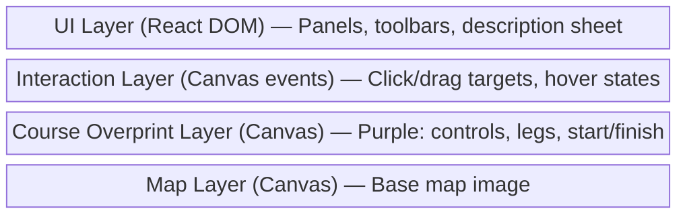
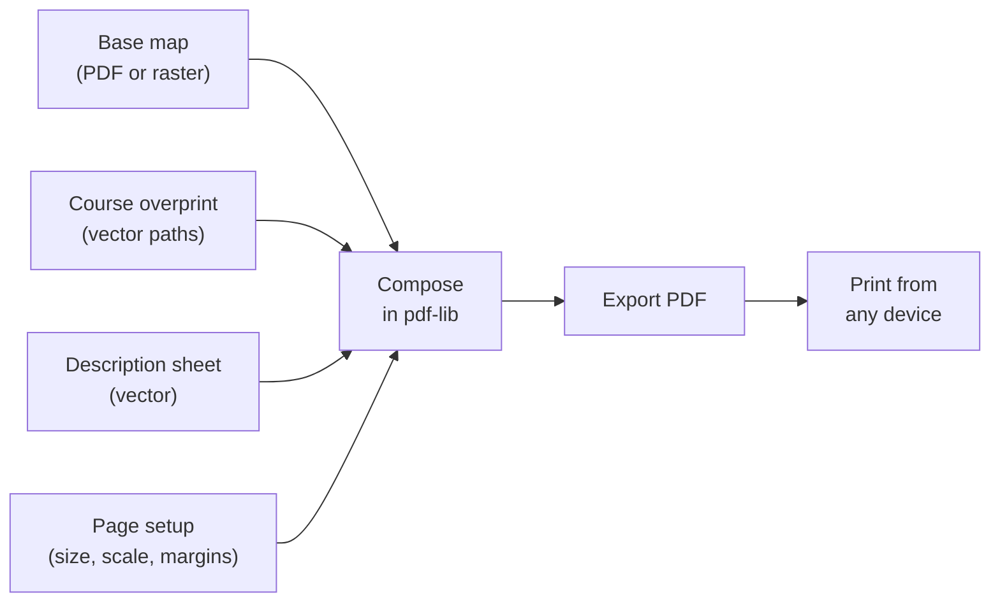
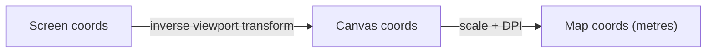

# Overprint — Technical Architecture

## Overview

Overprint is a fully client-side web application. All processing happens in the browser — no backend server, not just for MVP, but as a long-term architectural commitment. This keeps deployment trivial (static CDN hosting), gives offline support for free, and means user files never leave their device.

## Architecture Decisions

### ADR-001: Client-Side Only (Long-Term Architecture)
**Decision**: All file processing, rendering, and export happens in the browser. This is not an MVP shortcut — it is the target architecture.

**Rationale**: Every core operation is lightweight and browser-native:

| Operation | Client-side approach |
|---|---|
| Map rendering (raster/PDF) | Canvas + PDF.js (Web Worker) |
| Course overlay drawing | Canvas 2D — small number of shapes |
| Distance/geometry | Simple pixel math, tiny data |
| IOF XML import/export | DOMParser / string templating |
| PDF export | pdf-lib |
| Save/load project files | File API, IndexedDB, OPFS |
| .omap parsing | JSZip + XML |
| OCAD map loading | ocad2geojson (JS, client-side) — see ADR-010 |

Course data is kilobytes even for complex multi-course events. Map files (the heaviest input at a few MB) are handled by proven browser libraries. There is no operation that requires server compute.

**What this gives us**: Zero hosting costs, offline-capable, no auth/API complexity, user privacy (files stay on-device), no backend to maintain or secure.

**Inflection point**: The only scenario that would require a server is real-time collaboration — and even that could be peer-to-peer via CRDTs (Yjs) over WebRTC. Collaboration is explicitly out of scope.

**Trade-off**: OCAD binary parsing was originally the hardest client-side challenge, but `ocad2geojson` (Per Liedman's JS library) handles this entirely in the browser. See ADR-010.

### ADR-002: HTML5 Canvas for Map + Course Rendering
**Decision**: Use HTML5 Canvas (not SVG DOM) for the map display and course overlay.
**Rationale**: Orienteering maps can be very large raster images. SVG would struggle with a full-resolution map as a background. Canvas gives us smooth pan/zoom via transforms, efficient rendering of the purple overprint layer, and good performance on mobile. We'll evaluate Konva.js vs Fabric.js vs raw Canvas 2D during Phase 0, but lean toward **Konva.js** for its React integration (react-konva) and built-in event handling on shapes.
**Trade-off**: Canvas is harder to make accessible than SVG/DOM. We'll mitigate with an accessible sidebar for the course data and description sheet.

### ADR-003: Layered Canvas Rendering
**Decision**: Render the map and course overprint as separate conceptual layers.

**Rationale**: Separating layers means we can re-render the course without redrawing the (expensive) map. It also maps cleanly to how orienteering printing works — the purple overprint is a distinct layer.

### ADR-004: Zustand for State Management
**Decision**: Use Zustand rather than Redux, Jotai, or React Context.
**Rationale**: Zustand is lightweight, TypeScript-friendly, and doesn't require providers/wrappers. The state model for Overprint is relatively flat (event → courses → controls). Zustand's `immer` middleware gives us immutable updates without boilerplate. It also works well with undo/redo via middleware.

### ADR-005: Overprint JSON as Native File Format
**Decision**: Define our own JSON-based file format (.overprint) for saving/loading events.
**Rationale**: We need a serialisation format. JSON is human-readable, diffable, and trivial to parse in JavaScript. We version the format schema so we can evolve it. IOF XML is used for interchange with other systems, but JSON is our working format.

### ADR-006: PDF.js for PDF Map Loading
**Decision**: Use Mozilla's PDF.js to render PDF maps to canvas.
**Rationale**: PDF is the most common orienteering map distribution format. PDF.js is the industry-standard browser-based PDF renderer. We render the first page (or a user-selected page) to an offscreen canvas at a configurable DPI, then use that as the map image.

### ADR-007: pdf-lib for PDF Export
**Decision**: Use pdf-lib for generating PDF exports (course maps, description sheets).
**Rationale**: pdf-lib works entirely in the browser, supports embedding images, drawing vectors, and text. It's well-maintained and doesn't require a server.

### ADR-008: PDF as Print Output with Vector Overprint
**Decision**: PDF is the sole print output format. The course overprint is rendered as vector paths (not rasterised canvas), so circles, lines, and numbers are resolution-independent and crisp at any DPI. When the base map source is a PDF, we embed the original page to preserve full source quality.
**Rationale**: Print quality is critical for competition maps. Vector overprint + PDF source embedding gives the best possible output. PDF is universally printable from any device. See full ADR at `docs/adrs/ADR-008-pdf-print-output.md`.

## Save / Load

Users save and load event files via download/upload — no server, no accounts.

- **Save**: Serialize Zustand state to JSON → `Blob` → browser download as `.overprint` file
- **Load**: File picker → `FileReader` → parse JSON → validate schema version → hydrate store
- **Import PurplePen (.ppen)**: Same flow but parse XML instead of JSON (Phase 6)
- **Import IOF XML**: Parse course/control data without map file (Phase 3)

Progressive enhancement for repeat saves:

| Approach | UX | Browser support |
|---|---|---|
| Download/upload (Blob + FileReader) | Manual save/load, works everywhere | Universal |
| File System Access API (`showSaveFilePicker`) | Save-in-place like a native app | Chromium (Chrome, Edge) |
| OPFS | Auto-save to browser-local storage | Chrome, Firefox, Safari |

MVP uses download/upload. File System Access API is a natural enhancement for Chromium users — lets Cmd+S write directly to the original file location.

## Page Setup and Print Export

The user configures page layout before PDF export:

| Setting | Typical values | Notes |
|---|---|---|
| Paper size | A4, A3, Letter, custom | A4 most common for club events |
| Orientation | Portrait / Landscape | |
| Print scale | 1:4000, 1:10000, 1:15000 | Determines how much map fits on the page |
| Margins | 5–15mm | Accounts for non-printable area |

Print scale is independent of the map's native scale — course setters routinely print a 1:15000 map at 1:10000 for older age classes. All overprint dimensions (circle diameter, line width, number size) are defined at the print scale.



See `docs/adrs/ADR-008-pdf-print-output.md` for the full decision record.

## Data Model (Core Types)

```typescript
interface OverprintEvent {
  id: string;
  name: string;
  mapFile: MapFile;
  courses: Course[];
  controls: Control[];         // Shared pool of controls across courses
  settings: EventSettings;
  version: string;             // File format version
}

interface MapFile {
  name: string;
  type: 'raster' | 'pdf' | 'ocad' | 'omap';
  scale: number;               // e.g., 10000 for 1:10000
  dpi: number;                 // Resolution for coordinate mapping
  // Georeferencing (optional, for future use)
  georef?: GeoReference;
}

interface Control {
  id: string;
  code: number;                // IOF code, >30
  position: MapPoint;          // Position on map in map coordinates
  description: ControlDescription;
}

interface ControlDescription {
  // IOF 2024 standard columns A-H
  columnA?: number;            // Sequence number (set per course)
  columnB?: number;            // Control code
  columnC?: string;            // Which of similar features
  columnD: string;             // Feature (the control feature symbol)
  columnE?: string;            // Appearance / detail
  columnF?: string;            // Dimensions / combinations
  columnG?: string;            // Location of flag
  columnH?: string;            // Other information
}

interface Course {
  id: string;
  name: string;
  courseType: 'normal' | 'score';
  controls: CourseControl[];   // Ordered list referencing Control IDs
  climb?: number;              // Optional climb in metres
  settings: CourseSettings;
}

interface CourseControl {
  controlId: string;           // Reference to Control.id
  type: 'start' | 'control' | 'finish' | 'crossingPoint' | 'mapExchange';
  sequenceNumber?: number;
  score?: number;              // For score courses
}

interface MapPoint {
  x: number;                   // Pixels from left of map image
  y: number;                   // Pixels from top of map image
}

interface EventSettings {
  printScale: number;
  controlCircleDiameter: number;  // mm at print scale
  lineWidth: number;              // mm at print scale
  numberSize: number;             // mm at print scale
  descriptionStandard: '2018' | '2024';
  mapStandard: 'ISOM2017' | 'ISSprOM2019';
  pageSetup: PageSetup;
}

interface PageSetup {
  paperSize: 'A4' | 'A3' | 'Letter' | 'custom';
  customWidth?: number;            // mm, only if paperSize is 'custom'
  customHeight?: number;           // mm, only if paperSize is 'custom'
  orientation: 'portrait' | 'landscape';
  margins: {                       // mm
    top: number;
    right: number;
    bottom: number;
    left: number;
  };
}
```

## Coordinate Systems

This is critical to get right. There are three coordinate systems in play:

1. **Screen coordinates** — pixels on the user's screen. Origin at top-left of viewport.
2. **Canvas coordinates** — pixels on the canvas, adjusted for pan and zoom. The map image is drawn in canvas coordinates.
3. **Map coordinates** — real-world distances on the map, in metres. Derived from canvas coordinates using the map scale and DPI.



**Distance calculation**: To get the real-world distance of a leg:
```
pixel_distance = sqrt((x2-x1)² + (y2-y1)²)
map_distance_mm = pixel_distance / dpi * 25.4
real_distance_m = map_distance_mm * scale / 1000
```

## Rendering: Purple Overprint

The course overprint must be rendered following IOF specifications:

- **Colour**: Purple/violet — Pantone 814, screen approximation `#B040B0` or similar. PurplePen uses a specific purple; we should match or closely approximate.
- **Control circle**: 6mm diameter at print scale (ISOM 2017). Gap in circle where it would obscure map detail (implementation: user adjustable, or auto-gap near legs).
- **Start triangle**: Equilateral, 7mm side length at print scale, point towards first control.
- **Finish circle**: Double circle, outer 7mm, inner 5mm diameter at print scale.
- **Legs**: Lines connecting control centres, typically 0.35mm line width at print scale.
- **Control numbers**: Positioned near control circle, avoiding obscuring map features.
- **Crossing point**: An X symbol.
- **Marked route**: Dashed line.

All dimensions are specified at print scale, so we need to convert based on the current zoom level for screen display, and based on the target DPI for PDF export.

## IOF XML v3 Support

The IOF XML Data Standard v3 is the interchange format for course data. We need to:

**Export**: Generate XML containing course definitions, control positions (with optional geo-coordinates), and control descriptions. This lets event software (OE, MeOS, etc.) and electronic punching systems (SPORTident, EMIT) import our courses.

**Import**: Parse IOF XML to load courses from other software. This allows importing courses originally created in PurplePen or Condes, though without the map file.

Reference: https://orienteering.sport/iof/it/iof-xml/

## File Loading Strategy

### Raster Images (Phase 0)
Straightforward: `FileReader` → `Image` → draw to canvas. Support PNG, JPEG, GIF. User must manually set the map scale.

### PDF Maps (Phase 0)
Use PDF.js to render to an offscreen canvas at a target DPI (e.g., 150–300 DPI depending on performance). The rendered bitmap becomes the map image. PDF.js runs in a Web Worker for performance.

### OCAD Files (Phase 1)
Parsed client-side via `ocad2geojson` (Per Liedman's JS library). Supports OCAD 10, 11, 12, and 2018. The library reads the binary format from an `ArrayBuffer` and outputs SVG (for rendering) and GeoJSON (for geometry). We serialize the SVG to a Blob URL, load it as an `HTMLImageElement`, and display it on the Konva canvas. Map scale is extracted from OCAD parameter strings. See ADR-010.

### OpenOrienteering Mapper .omap (Phase 5)
The .omap format is XML (actually a ZIP containing XML). It describes vector map objects with symbol references. Rendering this properly means implementing a subset of the ISOM/ISSprOM symbol renderer. This is a significant effort but the XML structure is well-documented.

## Undo/Redo

Implemented via a command pattern with Zustand middleware:
- Every state mutation is captured as a reversible action
- Undo stack (min 50 levels, target 100)
- Standard keyboard shortcuts: Cmd/Ctrl+Z, Cmd/Ctrl+Shift+Z

## Performance Considerations

- **Large map images**: Some orienteering maps at 300 DPI can be 10000+ pixels wide. Use `createImageBitmap()` for async decoding. Consider tiling for very large maps.
- **Canvas redraw**: Only redraw the course overlay layer on control changes; the map layer is static after initial render.
- **Mobile**: Touch events for pan/zoom must feel native. Use passive event listeners, `requestAnimationFrame` for smooth transforms.
- **PDF rendering**: Offload to Web Worker. Show loading indicator.

## Future Technical Considerations

- **PWA / Service Worker**: Cache the app shell for offline use. Map files stay in IndexedDB or the Origin Private File System. Natural fit for the client-side architecture.
- **WebAssembly**: If deeper OCAD support is needed beyond what `ocad2geojson` provides (e.g. full symbol editing, round-trip save), a WASM module compiled from OpenOrienteering Mapper's C++ reader could supplement or replace the JS parser.
- **Collaboration**: The only scenario that would introduce a server dependency. Even then, CRDTs (Yjs) over WebRTC can work peer-to-peer. Out of scope — noted here only as the architectural inflection point.
