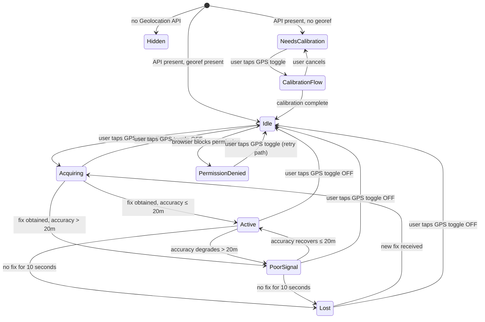
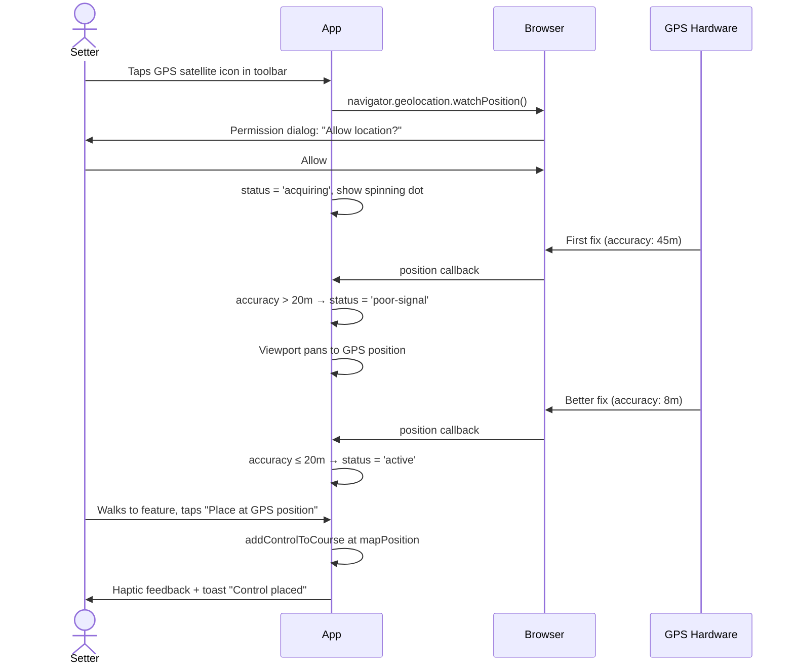
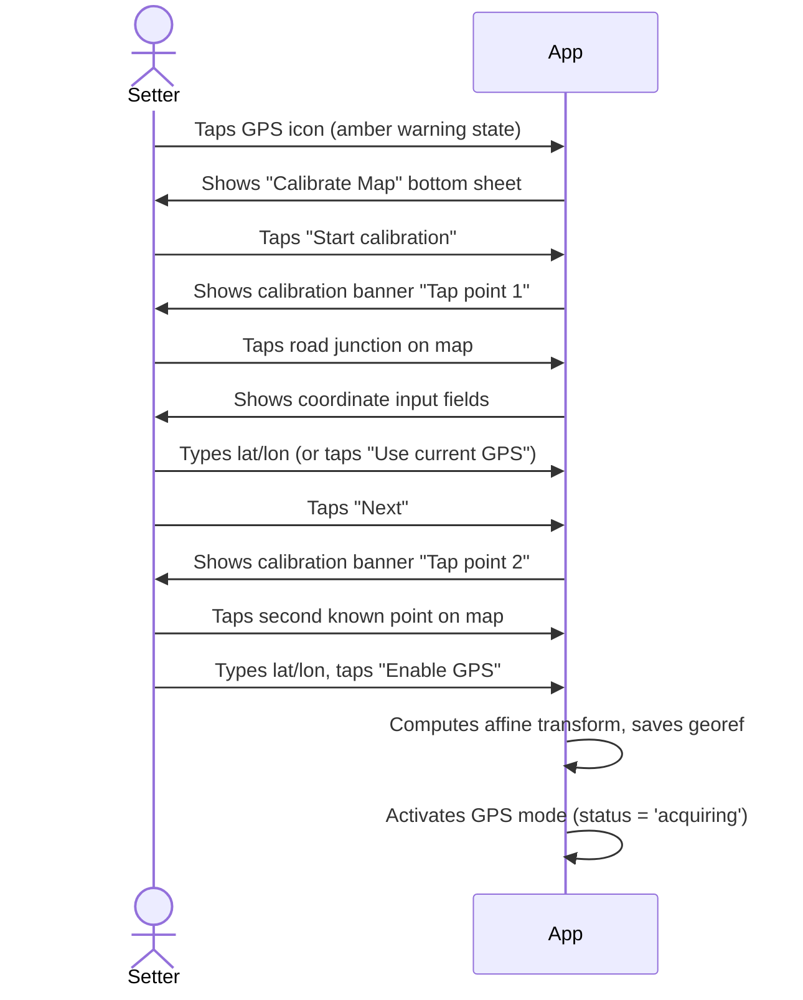

# GPS Control Placement — UX Specification

**Feature:** Field GPS control placement
**Status:** Design / pre-implementation
**Last updated:** 2026-03-20
**Context:** Overprint v0.9+ — web app, React/Konva, Zustand

---

## 1. Problem Statement

Orienteering course setters go into the terrain carrying a phone or tablet with the map loaded. When they physically stand at a feature they want to set a control on, they currently have to:

1. Estimate their position on the map by visual reference.
2. Pan/zoom to find that point.
3. Tap or use the reticle to place the control.

This is slow, error-prone in dense terrain, and requires fine motor control that is difficult in the field (gloves, rain, fatigue). GPS placement removes step 1–2 entirely: the app knows where you are and places the control there.

---

## 2. Preconditions and Capability Gates

GPS placement requires two things to be true simultaneously:

| Gate | Check | Failure behaviour |
|---|---|---|
| Device has GPS | `'geolocation' in navigator` | GPS toggle not shown at all |
| Map is georeferenced | `event.mapFile.georef` is set | Toggle shown but disabled, tap prompts calibration |

The GPS toggle must never appear on a non-GPS device (desktop without location hardware, browser with Geolocation API blocked at the OS level). On a georef-capable device where the map has no georef data, the toggle is visible but in a distinct "needs calibration" state.

---

## 3. State Machine



---

## 4. GPS Toggle Button

### 4.1 Desktop toolbar (>=1024px)

**Location:** Zone 3 of the existing toolbar, after the "Add Control" button, separated by a 1px divider. Only renders when `'geolocation' in navigator`.

**Appearance variants:**

| State | Visual |
|---|---|
| Needs calibration | `bg-gray-100 text-gray-400 ring-1 ring-amber-300` — satellite icon with small warning badge |
| Idle (georef ok) | `bg-gray-100 text-gray-600 hover:bg-gray-200` — satellite icon only |
| Acquiring | `bg-blue-50 text-blue-500` — satellite icon with spinning ring, `animate-spin` |
| Active (good fix) | `bg-blue-100 text-blue-700 ring-1 ring-blue-400` — filled satellite icon |
| Poor signal | `bg-amber-50 text-amber-600 ring-1 ring-amber-400` — satellite icon with exclamation |
| Lost | `bg-red-50 text-red-600 ring-1 ring-red-300` — satellite icon with slash |
| Permission denied | `bg-gray-100 text-gray-300 cursor-not-allowed` — satellite icon with lock badge |

Button dimensions: 40×40px minimum (same as undo/redo buttons). Uses an SVG satellite dish icon (or a minimal GPS-target icon — a circle with crosshairs, which reads clearly at 18×18px). Icon chosen over label text to save toolbar space.

**Tooltip / title attribute:**
- Idle: "Enable GPS placement"
- Acquiring: "Acquiring GPS signal…"
- Active: "GPS active — tap to disable"
- Poor signal: "GPS active — poor accuracy (Nm)"  (where N = current accuracy in metres)
- Lost: "GPS signal lost"
- Needs calibration: "Map not georeferenced — tap to calibrate"
- Permission denied: "Location access denied — check browser settings"

### 4.2 Mobile/tablet compact toolbar (<1024px)

**Location:** Right side of the compact header, between the tool buttons (✋/⊕) and the undo/redo group. A single 40×40px icon button using the same states as desktop.

This keeps the header from overflowing. On narrow phones (375px width) the header already fits: hamburger + event name (flex-1/truncated) + pan + add + GPS + undo + redo = 7 zones, which fits at ~40px each with the event name truncating.

If overflow becomes a real problem at very small sizes (320px devices), the GPS button shifts to be the first item right of the hamburger menu — before the event name — since it is mode-critical in field use.

### 4.3 Mobile FAB integration

The MobileFab currently toggles between pan and addControl. When GPS is active and `activeTool.type === 'addControl'`, the FAB displays a blue satellite icon instead of ⊕ to signal the GPS-enhanced mode. This is a visual indicator only — the FAB still cycles tools as before.

The GPS toggle itself lives in the toolbar (above), not the FAB. This avoids conflating two separate mode switches.

---

## 5. GPS Indicator on the Map Canvas

When GPS state is Acquiring, Active, or Poor Signal, a GPS position overlay renders on the Konva canvas.

### 5.1 Implementation

A new `<GpsPositionLayer>` Konva Layer, inserted after the course overprint layer and before the special items layer in `map-canvas.tsx`. It is `listening={false}` (non-interactive) and only renders when GPS state is not Idle/Hidden.

The layer receives the current GPS position in map-space coordinates (converted from WGS-84 via the georef transform).

### 5.2 Visual elements

**Accuracy circle:**
- Radius computed from GPS accuracy in metres, converted to map pixels via georef + viewport scale.
- Fill: `rgba(59, 130, 246, 0.12)` (blue, 12% opacity)
- Stroke: `rgba(59, 130, 246, 0.35)`, strokeWidth 1.5px
- Not rendered when accuracy > 200m (meaningless at that scale)

**Position dot:**
- Outer ring: white, 14px diameter — ensures contrast on all map backgrounds.
- Inner dot: `#3B82F6` (blue-500), 10px diameter
- When Acquiring: inner dot replaced by a spinning arc (CSS animation on an absolutely positioned div overlaid on the canvas)
- When Poor Signal: inner dot colour changes to `#F59E0B` (amber-500)
- When Lost: inner dot colour changes to `#EF4444` (red-500) and dot pulses with opacity animation

**Why blue?** The overprint colour is violet/purple (`#CD59A4`). Blue is distinct and is the universal convention for "my location" (Google Maps, Apple Maps, OSM, etc.). Orienteers will immediately read a blue dot as their position.

### 5.3 Auto-follow behaviour

When GPS is Active or Acquiring, the viewport auto-pans to keep the GPS dot visible:

- **Trigger:** If the GPS position is outside the visible viewport area (with a 10% padding inset from each edge), the viewport smoothly pans to re-centre on the GPS position.
- **Override:** If the user manually pans (touch or mouse), auto-follow suspends for 8 seconds, then re-engages. A small "Follow GPS" chip appears in the bottom-left corner while follow is suspended, allowing the user to re-engage immediately.
- **Zoom:** Auto-follow does NOT change zoom. The user controls zoom explicitly.
- **Rationale:** Aggressive auto-follow is disorienting. Soft re-centering only when the dot leaves the view strikes the right balance for field navigation.

### 5.4 GPS Status Chip

A pill-shaped status indicator renders in the top-left of the map canvas area (below the toolbar, above zoom controls) — only when GPS is active:

```
[ ● Acquiring GPS... ]         ← blue pulsing dot, gray text
[ ● GPS — ±5m ]                ← blue dot, blue text
[ ▲ GPS — ±35m poor accuracy ] ← amber dot, amber text
[ ✕ GPS signal lost ]          ← red dot, red text
```

- Position: `absolute top-2 left-2 z-20` (within the map canvas container)
- Style: `bg-white/85 backdrop-blur-sm rounded-full px-3 py-1.5 text-xs font-medium shadow`
- The chip does not appear in Idle/Hidden states.
- On phone, the chip sits below the toolbar at `top-2 left-2` — this is clear of the FAB (bottom-right) and the reticle buttons (65% height).

---

## 6. Control Placement in GPS Mode

### 6.1 Phone (sm breakpoint, touch)

The existing `CenterReticle` component handles phone placement. In GPS mode it switches behaviour:

**Standard (non-GPS) reticle:**
- Crosshair fixed at screen centre
- Pan map to position crosshair over desired feature
- "Place here" places at crosshair = map centre

**GPS reticle mode:**
- Crosshair colour changes from violet to blue
- Crosshair position is NOT fixed at screen centre — it tracks the GPS position on screen
- If the GPS dot is within the viewport, the crosshair appears at the GPS dot's screen position
- If the GPS dot leaves the viewport (auto-follow triggered it back, or user panned away), crosshair is hidden and "Place here" is replaced with "Go to GPS position" button that re-centres the map on the GPS dot
- Accuracy circle is rendered around the crosshair when accuracy is available
- "Place here" label changes to "Place at GPS position"
- Undo button remains in the same position

**CenterReticle props change:** Add `gpsPosition?: { x: number; y: number } | null` and `gpsMode?: boolean` props. When `gpsMode` is true and `gpsPosition` is set, crosshair renders at the GPS screen position instead of container centre.

**Poor accuracy warning:** When accuracy > 20m, a warning appears above the Place button:
```
  ⚠ Poor accuracy — ±35m
  [ Place anyway ]  [ Cancel ]
```
This is a confirmation step, not a blocker. The setter may know the terrain and accept the fix.

### 6.2 Tablet (md breakpoint)

Tablet does not use the CenterReticle. Instead:

- The GPS dot is visible on the canvas.
- A floating "Place at GPS" button appears in the bottom-centre of the screen (above the safe area) when GPS is Active and `activeTool.type === 'addControl'`.
- Button style: `bg-blue-600 text-white rounded-full px-6 py-3 text-sm font-medium shadow-lg` — mirrors the phone "Place here" pill exactly but blue.
- When poor accuracy: button label changes to "Place at GPS (±35m)" and background shifts to `bg-amber-500`.

### 6.3 Desktop (lg breakpoint)

- GPS dot is visible on the canvas.
- Cursor in addControl mode shows as crosshair (existing behaviour).
- A keyboard shortcut `G` while `activeTool.type === 'addControl'` places a control at the current GPS position.
- A "Place at GPS position" option appears in the right-click context menu on the canvas (when GPS is Active).
- The GPS status chip (section 5.4) provides sufficient status feedback.
- No floating button — desktop users are not walking with the device; they are reviewing GPS-marked positions after field work.

---

## 7. Calibration Flow (Non-Georeferenced Maps)

### 7.1 Trigger

User taps the GPS toggle when `event.mapFile.georef` is absent or null.

### 7.2 Flow

**Step 1 — Explanation dialog (modal sheet):**

```
+------------------------------------------+
| Calibrate Map for GPS                    |
|                                          |
| Your map isn't georeferenced. To use GPS |
| placement, tap two points on the map     |
| that you know the GPS coordinates of.    |
|                                          |
| Example: a road junction, a building     |
| corner, or a benchmark.                  |
|                                          |
|   [ Cancel ]      [ Start calibration ]  |
+------------------------------------------+
```

Designed as a bottom sheet on phone, centered modal on desktop. Maximum width 420px.

**Step 2 — Point 1 picker:**

The sheet closes. A calibration overlay appears:

```
+------------------------------------------+
| Calibration point 1 of 2                 |
| Tap the map where you know the GPS       |
| coordinates.                             |
+------------------------------------------+
```

Thin banner at the top of the map canvas (`bg-amber-50 border-b border-amber-200`). The map is in pan mode. When the user taps, a yellow pin drops at that location. The banner changes:

```
+------------------------------------------+
| Enter GPS coordinates for this point     |
| [ -35.123456 ] [ 149.123456 ]            |
| Use current GPS?  ← button if GPS active |
|   [ Re-pick ]          [ Next → ]        |
+------------------------------------------+
```

Coordinate inputs are numeric, with clear labels (Lat / Lon). "Use current GPS" only appears if the GPS signal is currently Active and repurposes the phone's live position for convenience.

**Step 3 — Point 2 picker:** Same UI. The banner shows "Calibration point 2 of 2".

**Step 4 — Confirm:**

```
+------------------------------------------+
| Calibration complete                     |
|                                          |
| Point 1: -35.1234, 149.1234 → map (x,y) |
| Point 2: -35.1290, 149.1301 → map (x,y) |
|                                          |
| Accuracy depends on how precisely you    |
| identified these points.                 |
|                                          |
|   [ Re-do ]            [ Enable GPS ]    |
+------------------------------------------+
```

On confirm, georef data is written to `event.mapFile.georef` and GPS mode activates immediately.

**Minimum 2 points.** An "Add third point" option improves accuracy for non-affine distortions but is optional — most users will use 2.

### 7.3 Calibration Data Model

The georef stored is an affine transform: 2 control point pairs (map pixel → WGS-84 lat/lon). Implementation uses a standard 2-point affine registration (rotation + scale + translation). This is the same model PurplePen uses for non-OCAD maps.

---

## 8. Edge Case Handling

### 8.1 Permission Denied

**Detection:** `GeolocationPositionError.code === 1` (PERMISSION_DENIED).

**Response:**
1. GPS toggle shifts to `PermissionDenied` state (lock badge, disabled style).
2. Toast notification: "Location access denied. Enable in browser settings to use GPS placement."
3. Toast includes a "Help" link opening a small modal with browser-specific instructions (Chrome: Settings > Privacy > Location; Safari: Settings > Safari > Location).
4. The GPS toggle tooltip explains the state.
5. On retry tap: call `getCurrentPosition` again — some browsers allow re-request after user updates site permission.

### 8.2 Signal Acquiring

**Visual:** Blue pulsing dot at last known position (or centre of map if no fix yet), spinning ring.

**Behaviour:** "Place here" / "Place at GPS" buttons are disabled with tooltip "Waiting for GPS signal…". The setter can still use the standard manual placement while waiting.

**Timeout:** If no fix after 30 seconds, show toast: "GPS signal not found. Are you indoors?" with option to "Keep waiting" or "Turn off GPS".

### 8.3 Poor Accuracy (>20m)

**Threshold:** 20m is chosen because a standard orienteering control circle represents 5m on the ground at 1:10000, and a setter placing within 20m is "in the right area" but may want confirmation.

**Behaviour:**
- Yellow status chip.
- Place button shows accuracy warning.
- Still placeable — the setter makes the judgment call.
- Accuracy displayed numerically (e.g., "±35m") not as "poor/good" — orienteers will understand the metric.

### 8.4 GPS Lost (Went Indoors)

**Detection:** `watchPosition` error callback or 10-second gap since last position update.

**Response:**
- Red status chip: "GPS signal lost".
- GPS dot goes grey/faded on canvas.
- Placement buttons disabled.
- If the setter was indoors temporarily (e.g., checking notes in a car), auto-recovery when signal returns — no user action required.
- If lost for >60 seconds, show subtle toast: "GPS signal lost. Move outside to restore." (non-blocking, dismissible).

### 8.5 Battery

No battery indicator is shown. Geolocation with `watchPosition` is battery-intensive, but:
- Field sessions are typically <4 hours.
- The OS and browser manage battery concerns.
- Adding a battery indicator would require the Battery Status API, which has poor browser support and privacy restrictions.

**Mitigation in implementation:** Use `maximumAge: 3000` and `timeout: 10000` in `watchPosition` options to allow cached positions and reduce polling aggressiveness. Use `enableHighAccuracy: true` only when GPS mode is active.

---

## 9. Component Map

```
src/
  components/
    map/
      gps-position-layer.tsx        ← Konva Layer: blue dot + accuracy circle
      gps-status-chip.tsx           ← DOM overlay: status pill (Acquiring/Active/etc.)
      center-reticle.tsx            ← MODIFIED: gpsMode + gpsPosition props
      map-canvas.tsx                ← MODIFIED: render GpsPositionLayer, GpsStatusChip,
                                                 GPS "Place at GPS" button (md), stitch
                                                 GPS-mode reticle on sm
    ui/
      toolbar.tsx                   ← MODIFIED: GpsToggleButton in Zone 3 (desktop)
                                                 and compact toolbar
      gps-toggle-button.tsx         ← Extracted: standalone button with all state variants
      gps-calibration-modal.tsx     ← Calibration flow (steps 1–4)
  stores/
    gps-store.ts                    ← NEW: Zustand store — GPS state machine
  hooks/
    use-gps-position.ts             ← NEW: watchPosition wrapper, state transitions
  core/
    geometry/
      georef-transform.ts           ← NEW: lat/lon ↔ map-pixel affine transform
```

---

## 10. New Store: `gps-store.ts`

```typescript
type GpsStatus =
  | 'hidden'           // no Geolocation API
  | 'needs-calibration' // API present, no georef
  | 'idle'             // georef present, not active
  | 'acquiring'
  | 'active'
  | 'poor-signal'
  | 'lost'
  | 'permission-denied';

interface GpsState {
  status: GpsStatus;
  position: { lat: number; lon: number } | null;   // WGS-84
  mapPosition: { x: number; y: number } | null;     // map-pixel (computed)
  accuracy: number | null;                           // metres
  lastFixTime: number | null;                        // Date.now()
  followMode: boolean;                               // auto-pan active
}
```

State transitions live in the `useGpsPosition` hook, not in the store directly. The store is a plain state sink — the hook drives it.

---

## 11. Interaction Flow Diagrams

### 11.1 First use on georef map (phone)



### 11.2 Calibration flow (phone, no georef)



---

## 12. Visual Design Reference

### Colour palette additions (GPS-specific)

| Token | Value | Usage |
|---|---|---|
| `gps-dot` | `#3B82F6` | Active GPS dot fill |
| `gps-accuracy` | `rgba(59,130,246,0.12)` | Accuracy circle fill |
| `gps-accuracy-stroke` | `rgba(59,130,246,0.35)` | Accuracy circle stroke |
| `gps-poor` | `#F59E0B` | Poor signal dot, chip |
| `gps-lost` | `#EF4444` | Lost signal dot, chip |
| `gps-acquiring-stroke` | `rgba(59,130,246,0.5)` | Spinning acquisition ring |

All GPS colours are in the blue/amber/red space, deliberately separated from the violet overprint colour (`#CD59A4`) to avoid visual confusion between "my position" and "control symbols".

### Touch targets

All interactive GPS elements meet the 44×44px minimum:

- GPS toggle button: 40×40px base + 12px invisible padding = 64×64px total hit area (using `p-3` + container padding)
- "Place at GPS" bottom button: full-width pill, 48px height
- Calibration tap targets: minimum 44px with visual feedback on tap

### High-contrast / sunlight readability

- White halos around the GPS dot (14px white ring under 10px blue dot)
- Status chip uses `bg-white/85 backdrop-blur-sm` — avoids semi-transparent colours that wash out in sunlight
- Button text: always white on coloured background, never coloured text on light background for primary actions
- Avoid amber-on-white for body text — use amber background with dark text instead

---

## 13. Accessibility

The GPS feature runs on a canvas app, which has inherent a11y constraints. For the GPS-specific additions:

- `GpsToggleButton`: full `aria-label` with dynamic content matching tooltip text, `aria-pressed` state
- `GpsStatusChip`: `role="status"` `aria-live="polite"` — screen readers will announce status changes without interrupting
- Calibration modal: standard focus trap, `role="dialog"`, `aria-labelledby`
- "Place at GPS" button: `aria-describedby` linking to the GPS status chip

---

## 14. i18n Keys Required

```
gpsToggleEnable          → "Enable GPS placement"
gpsToggleDisable         → "Disable GPS placement"
gpsAcquiring             → "Acquiring GPS signal…"
gpsActive                → "GPS — ±{accuracy}m"
gpsPoorSignal            → "GPS — ±{accuracy}m (poor)"
gpsLost                  → "GPS signal lost"
gpsPermissionDenied      → "Location access denied"
gpsNeedsCalibration      → "Map not georeferenced"
gpsPlaceHere             → "Place at GPS position"
gpsPlaceHerePoor         → "Place anyway (±{accuracy}m)"
gpsWarningPoorAccuracy   → "Poor accuracy — ±{accuracy}m"
gpsGoToPosition          → "Go to GPS position"
gpsFollowResume          → "Follow GPS"
gpsCalibrateTitle        → "Calibrate Map for GPS"
gpsCalibrateExplain      → "Your map isn't georeferenced…"
gpsCalibrateStart        → "Start calibration"
gpsCalibratePoint        → "Tap point {n} of {total} on the map"
gpsCalibrateEnterCoords  → "Enter GPS coordinates"
gpsCalibrateUseCurrent   → "Use current GPS"
gpsCalibrateNext         → "Next"
gpsCalibrateComplete     → "Calibration complete"
gpsCalibrateEnable       → "Enable GPS"
gpsCalibrateRedo         → "Re-do"
gpsPermissionHelp        → "How to enable location access"
gpsSignalNotFound        → "GPS signal not found. Are you indoors?"
gpsKeepWaiting           → "Keep waiting"
gpsTurnOff               → "Turn off GPS"
gpsSignalLostLong        → "GPS signal lost. Move outside to restore."
```

---

## 15. Open Questions for Implementation

1. **Georef transform precision:** A 2-point affine handles scale, rotation, and translation. Does the app need a polynomial warp for heavily projected maps (e.g., large-area events where the map is not rectilinear)? Likely not for v1 — orienteering maps are small scale and the affine is adequate.

2. **OCAD/OMAP georef:** Many maps loaded from `.ocd` or `.omap` will already have georef data (`ocad2geojson` exposes it). The GPS feature should read this automatically and skip calibration entirely. Verify what fields `ocad2geojson` exposes and map them to the internal georef model.

3. **watchPosition vs polling:** `watchPosition` is preferred (event-driven). Battery impact is acceptable for field sessions. Confirm the `maximumAge`/`timeout` values in device testing.

4. **Compass heading:** Not in scope for v1, but the GPS dot could show a heading arrow (from `GeolocationCoordinates.heading`) in a later iteration. Leave the dot implementation extensible.

5. **Saving GPS positions to IOF XML:** IOF XML v3 supports `<MapPosition>` with `geoXML` georef data. If calibration/georef is implemented, should placed controls record their WGS-84 coordinates? This would allow import into other software (OCAD, PurplePen) with correct georef. Defer to v2 but design the data model to accommodate it.

6. **Multiple calibration sessions:** If the user calibrates, closes the app, and reopens — is the georef persisted in the `.overprint` file? Yes, it must be. Add `georef` to the `MapFile` type serialisation.
