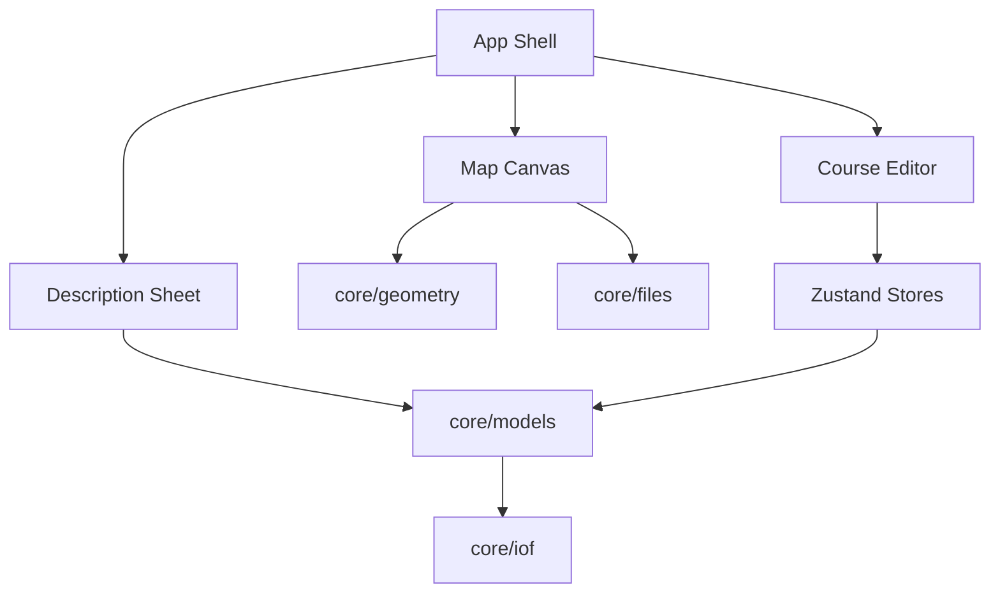

# Developer Onboarding Guide

**Overprint** — Web-based orienteering course setting software.

This guide walks you through setting up a local development environment, running the app, and understanding the codebase.

---

## Table of Contents

1. [Prerequisites](#1-prerequisites)
2. [Clone and Setup](#2-clone-and-setup)
3. [Running the App](#3-running-the-app)
4. [Running Tests](#4-running-tests)
5. [Code Quality](#5-code-quality)
6. [Project Structure](#6-project-structure)
7. [Key Conventions](#7-key-conventions)

---

## 1. Prerequisites

| Tool | Version | Purpose |
|------|---------|---------|
| Node.js | 20+ | Runtime |
| npm | 10+ | Package manager (bundled with Node) |
| Git | latest | Version control (SSH remotes only) |

### Installing prerequisites (macOS with MacPorts)

```bash
# Node.js
sudo port install nodejs20

# Git (if not already installed)
sudo port install git
```

---

## 2. Clone and Setup

Always use SSH for git remotes, never HTTPS:

```bash
git clone git@github.com:leitchy/overprint.git
cd Overprint
```

If the remote is using HTTPS, convert it:

```bash
git remote set-url origin git@github.com:leitchy/overprint.git
```

### Install dependencies

```bash
npm install
```

### Verify installation

```bash
npm run dev
```

The app should open at `http://localhost:5173` (Vite default).

---

## 3. Running the App

```bash
# Development server with hot reload
npm run dev

# Production build
npm run build

# Preview production build locally
npm run preview
```

---

## 4. Running Tests

```bash
# Unit tests
npm test

# Watch mode
npm run test:watch

# Coverage report
npm run test:coverage
```

---

## 5. Code Quality

### Linting

```bash
npm run lint
```

### Type checking

```bash
npm run typecheck
```

### Pre-commit workflow

Before submitting changes, run all checks:

```bash
npm run lint && npm run typecheck && npm test
```

---

## 6. Project Structure

```
overprint/
├── src/
│   ├── app/                   # App shell, routing, layout
│   ├── components/
│   │   ├── map/               # Map canvas, pan/zoom, layers
│   │   ├── course/            # Course editor, control placement
│   │   ├── descriptions/      # Control description sheet renderer
│   │   └── ui/                # Shared UI components
│   ├── core/
│   │   ├── models/            # Domain types: Course, Control, Event
│   │   ├── iof/               # IOF XML import/export
│   │   ├── files/             # Map file loaders (PDF, raster, omap)
│   │   └── geometry/          # Distance calc, coordinate transforms
│   ├── stores/                # Zustand stores
│   └── utils/                 # Shared utilities
├── public/
│   └── symbols/               # IOF control description symbol SVGs
├── docs/
│   ├── adrs/                  # Architecture Decision Records
│   ├── guides/                # This guide, workflows
│   ├── plans/                 # Implementation plans
│   ├── reference/             # Standards, specs
│   ├── research/              # Exploration, spikes
│   └── archive/               # Superseded docs
├── package.json
├── tsconfig.json
├── vite.config.ts
└── index.html
```

### Module responsibilities



---

## 7. Key Conventions

### TypeScript strict mode
No `any` types unless absolutely necessary. Strict mode is enabled in `tsconfig.json`.

### Functional React
Hooks only, no class components.

### Named exports
No default exports except where required by framework.

### File naming
- kebab-case for files (`map-canvas.tsx`)
- PascalCase for components (`MapCanvas`)

### Tests alongside source
`*.test.ts` files next to the code they test.

### Commits
Conventional commits: `feat:`, `fix:`, `refactor:`, `docs:`.

### Diagrams
All documentation diagrams use Mermaid syntax.

### Domain concepts

| Concept | Description |
|---------|-------------|
| **Event** | Container for a competition — has a map and courses |
| **Map** | Base orienteering map loaded from file, with a scale |
| **Course** | Ordered sequence of controls forming a route |
| **Control** | Point on map with code (>30) and IOF description |
| **Leg** | Connection between consecutive controls |
| **Overprint** | Purple layer drawn on top of the base map |

---

## Next Steps

1. Read `CLAUDE.md` in the project root for full project context.
2. Review `docs/architecture.md` for technical decisions.
3. Review `docs/product-spec.md` for feature phases.
4. Check `docs/iof-standards.md` for the orienteering standards we follow.
