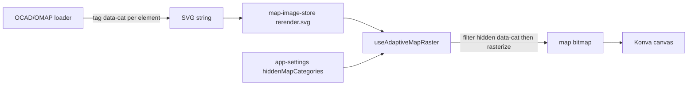

> **STATUS: implemented (2026-08-16, uncommitted on `develop`)** — classifier, OCAD/OMAP
> `data-cat` tagging, `applyMapDimming`, per-map session state, restructured re-raster hook,
> and the Map Settings UI section are all in. 796 tests green, typecheck + build clean, and
> verified live: the Declutter preset dims vegetation + open-land to 12% on the sample OCAD map
> while contours/water/black/overprint stay full strength. Deferred: native translations for the
> 7 new i18n keys (English fallback active in the other 7 languages), and the DOM-SVG instant path.

# Plan — Map colour dimming, grouped by the map's colour table (screen-only)

_2026-08-15. Feature: let a course setter **dim** groups of OCAD/OMAP map colours on screen
to declutter a busy map while placing controls. Screen-only for v1 (never affects exports).
Phase 2 (later): optional export filtering. **Revised after a 3-way team review** (architecture,
frontend/UX, Fable deep-reasoning) — see "Review reconciliation" for what changed and why._

## Review reconciliation (what the team review changed)

The original plan (tag SVG by inferred ISOM category → DOMParser-remove hidden → re-raster) was
plumbed at the right point but wrong in five ways. Consensus changes, folded in below:

1. **Dim, don't hide** (Fable, safety-critical). Hard-hiding blue/black lets a setter place a
   control on an invisible cliff or route a leg across an invisible marsh, and "uncertain stays
   visible" makes a partly-hidden category look *broken*. Per-group **dim to ~12% opacity** keeps
   features ghost-visible (safe) and makes any misclassification read as "faded, still there" not
   "toggle didn't work". Same implementation cost. Harmonises with the existing `mapFade`.
2. **Classify from the colour TABLE, name-first** (Fable). Both loaders carry named colour
   entries (`OmapColor.name` "Vegetation green 50%", OCAD colour names). Grouping the map's *own
   declared colours* (name → category, CMYK heuristic only as fallback, naive RGB→CMYK last
   resort for pre-CMYK `.omap`) makes misclassification structurally rare instead of
   threshold-tuned, and fixes the "old RGB-only OMAP → everything 'other'" coverage hole. Matches
   **Condes** (the course-setting tool setters actually use), which toggles colour-table entries.
3. **Four groups, drop "black"** (Fable). Black = paths, tracks, cliffs, buildings, fences, north
   lines — the *skeleton a setter navigates and hangs legs on*. Nobody dims all black. v1 groups:
   **Contours (brown)**, **Water (blue)**, **Vegetation (green)**, **Open land (yellow)**;
   everything else stays full-strength. The genuinely-wanted "rock detail but keep paths" split
   needs ISOM symbol numbers (2xx vs 5xx) which ocad2geojson's SVG doesn't carry — out of scope,
   stated so no one thinks a black toggle would cover it.
4. **`` into the SVG string. Removes nothing, so the
   whole defs/pattern-guard problem evaporates; no parse/serialise of multi-MB SVG; and it's the
   **same attribute+CSS the live DOM-SVG path uses**, so that path gets an instant, zero-re-raster
   toggle for free.
5. **Don't persist across sessions** (Fable). Hidden layers are silent state — reopen next week,
   water's just "missing". v1 state is **session-only, reset on map load**, plus a small always-on
   canvas badge ("Map dimmed — 2 groups") whenever the set is non-empty.

**Strategic target (all three reviewers):** the `?svgmap=1` DOM-SVG display path
(`map-svg-layer.tsx`, `map-canvas.tsx:79`) makes dimming a live CSS toggle with none of the
raster path's re-raster/base-bitmap complexity. v1 ships on the raster path (contained, no display
re-architecture) but the `data-cat` + `` after `<svg …>`.
  Empty-set fast path returns the input **unchanged** (zero cost when unused).
- Nothing is removed → no defs/pattern guard needed; SVG-as-`` rasterization honours the
  internal `<style>`. The **same** injected rule drives the live DOM-SVG path (instant, no re-raster).
- **Export-safety invariant (must state + test):** the dimmed string is **function-local** and
  passed straight to `rasterizeSvgToImage`; it is **never written back** to
  `map-image-store.rerender.svg` (which exports read verbatim). Guard with BOTH the
  `export-theme-safety` import-scan AND a positive test that the export SVG source is
  byte-identical with groups dimmed vs not.

### 4. State — `app-settings-store.ts`, **session-only**
- `dimmedMapGroups: MapColourGroup[]` + `toggleMapGroup` / `setDimmedMapGroups` / a `declutter()`
  preset (dims green+yellow). **Not persisted to localStorage; reset on map load** (mapVersion
  change) — avoids the silent-state trap. Screen-only.
- A small always-visible canvas badge ("Map dimmed — N groups") whenever the set is non-empty,
  so a filtered map is never mistaken for the real thing.

### 5. Render wiring — `use-adaptive-map-raster.ts` (restructured, not just subscribed)
The two early-returns at `:66-75` mean a toggle at base zoom (the common case) currently never
reaches a rasterize — both reviewers flagged this as a blocker. Restructure:
- Track `appliedDimKey = [...dimmed].sort().join(',')`. A re-raster is required when the density
  branch warrants it **OR** `dimKey !== appliedDimKey`.
- Keep `baseImageRef` = the **unfiltered** original. Add a tiny cache `{ dimmedBaseForKey }`. At
  base density with `dimmed` non-empty, rasterize a *dimmed base-density* bitmap (cached by key)
  instead of returning; with `dimmed` empty, blit the unfiltered `baseImageRef` directly.
- Subscribe to `dimmedMapGroups`; a discrete toggle re-rasters on the next frame (do **not** wait
  out the zoom `SETTLE_MS`). `genRef` still discards stale async results (handles zoom+toggle race).
- Keep the *current* bitmap visible until the new one is ready (optimistic — no blank frame), as
  the zoom path already does.

### 6. UI — inline collapsible section in `MapSettingsPanel` (not a popover)
- Match the existing `mapFade` block: a collapsible section (session-open state) inside the same
  `absolute left-4 top-4` panel, styled with `border-t border-edge pt-2`. No popover (inconsistent
  + mobile-positioning pain).
- Vertical list, one row per group: **colour swatch** (ISOM hue) + label + toggle. A "Declutter"
  button (green+yellow) and "Reset" (mirrors `mapFadeReset`).
- Show **only groups actually present** in the loaded map — scan the SVG's `data-cat` tags once at
  load. A category with zero elements isn't offered (sprint map → no Contours row).
- **Omit the whole section** for raster/PDF maps (`rerender?.kind !== 'svg'`) — not a disabled row.
- i18n: 4 clean labels — **Contours / Water / Vegetation / Open land** (the swatch removes
  ambiguity; avoids the "Open/rough" & "Rock & detail" translation pitfalls the original had).
  Verify current mobile layout of `MapSettingsPanel` before finalising (it's a fixed corner box
  today, not a bottom-sheet).

## Testing
- `ink-classification.test.ts`: `mapColourGroup` — name-first matches ("Vegetation green 50%"→
  green, "Brown 30%"→brown), CMYK fallback (brown-vs-yellow boundary), RGB→CMYK last resort,
  grey/black/white→'other'.
- `apply-map-dimming.test.ts`: injects the `<style>` rule for dimmed groups, empty-set returns
  input byte-identical, keeps all elements (removes nothing), malformed-SVG resilience.
- `load-ocad.test.ts`: `data-cat` from **effective** (inherited-`<g>`) paint, fill-wins-else-stroke,
  collision→'other'. `load-omap.test.ts`: `data-cat` on the **pattern-fill area path** + glyph
  inner elements + text/strokes; pre-CMYK colour → RGB fallback group.
- `app-settings`: `dimmedMapGroups` is **not** persisted and resets on map load.
- `export-theme-safety.test.ts`: (a) no export module imports `dimmedMapGroups`; (b) **positive**
  test — export SVG source (`rerender.svg`) is byte-identical with groups dimmed vs shown; (c)
  `svg-to-pdf` ignores unknown `data-cat`.
- Playwright: load sample OCAD, dim "Vegetation", assert the re-rasterized bitmap changed, the
  overprint is untouched, the badge shows, and a PDF export still contains full-strength veg.
- Responsive check (mobile/tablet/desktop) of the new panel section.

## Risks / open questions
1. **Classification accuracy** — much reduced by name-first (toggling the map's *own* colours),
   but non-standard/renamed tables still fall back to CMYK. `'other'` = full strength keeps it
   safe. Acceptance = the 4 groups visibly correct on the OCAD sample + Radford/Mt-Taylor OMAP.
2. **Partial dimming on pre-CMYK / renamed colours** — some greens dim, some don't. Dim (not
   hide) makes this read as "faint" not "broken"; don't offer a group with zero elements on the map.
3. **Re-raster latency** (raster path only) — one-off per toggle, current bitmap stays visible
   until swap. Evaporates entirely on the DOM-SVG path (the strategic target).
4. **DOM-SVG graduation** — out of scope for v1 but the mechanism is designed for it; revisit
   once ADR-015's spike is production-ready.
5. **Knockout/white areas** under a dimmed colour — minor, and dim (vs remove) makes it a
   non-issue.

## Effort
Medium. Order: classify (name-first) → tag (OCAD effective-paint + OMAP incl. pattern-fill) →
`applyMapDimming` → session state + badge → restructure re-raster hook → UI section → tests. Each
step independently testable. Export dimming is a separate later phase.
