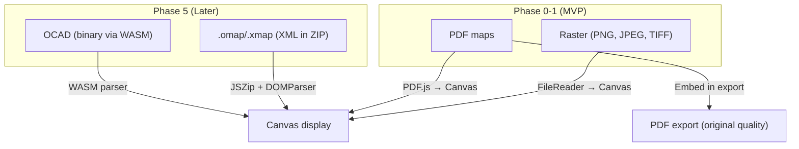
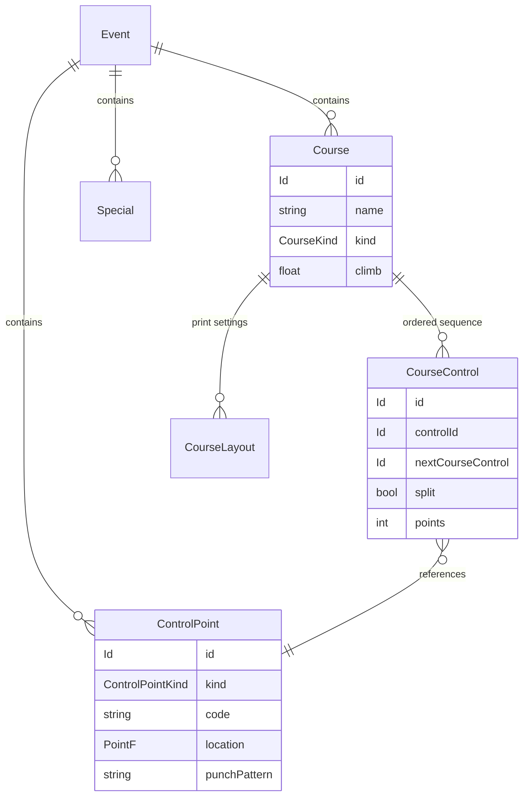
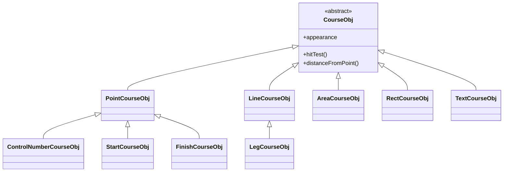
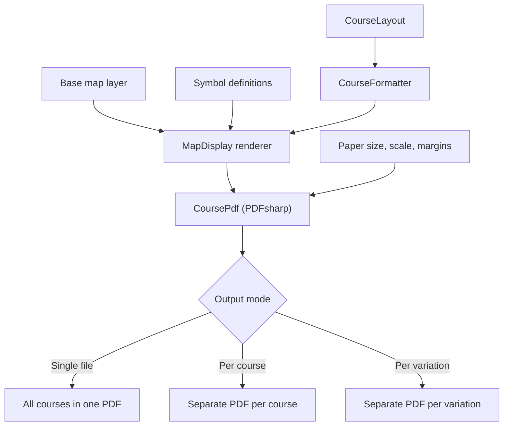
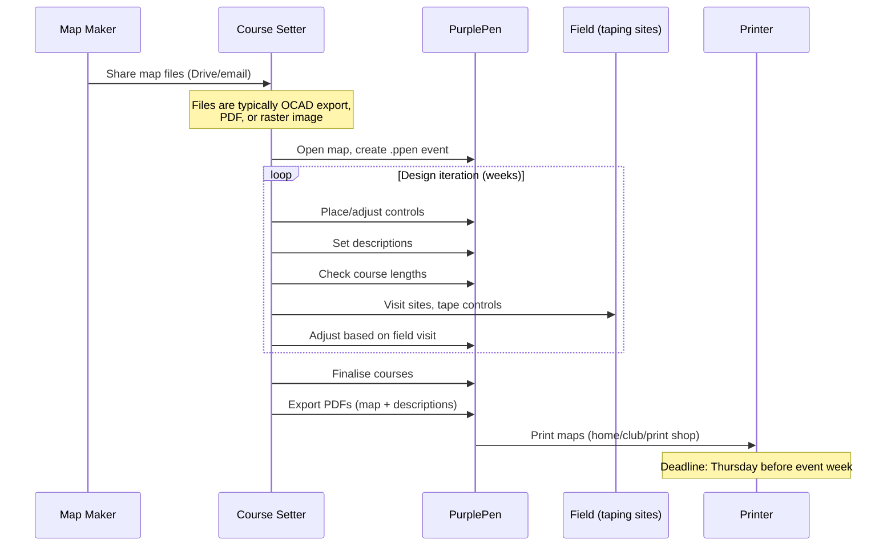

# PurplePen Deep Review

A comprehensive analysis of PurplePen's architecture, features, and implementation — used to inform Overprint's design decisions.

**Source**: [purple-pen.org](https://purple-pen.org), [GitHub](https://github.com/petergolde/PurplePen), community documentation.
**Current version**: 3.5.5 (C#/.NET, Windows only)

---

## Map Format Support

This is the most architecturally relevant area for Overprint.

### Supported formats

| Format | Versions | How it works | Quality |
|---|---|---|---|
| **OCAD** | 6, 7, 8, 9, 10, 11, 12, 2018 | Binary parser reads coordinates, symbols, and colour definitions directly | Full vector — best quality |
| **OpenOrienteering Mapper** | .omap, .xmap (v6-9) | XML parser (ZIP-wrapped for .omap) | Full vector |
| **PDF** | Any | Via PDFsharp + PdfiumViewer | Vector preserved in export |
| **Raster** | PNG, JPEG, TIFF, GIF, BMP | FileReader → bitmap | Limited by input resolution |

### Key implementation details

- **OCAD parsing** is the most complex piece — PurplePen has a full binary parser (`OcadImport.cs`, ~2000+ lines) that handles version-specific quirks, coordinate conversion (0.01mm units → world coordinates), CMYK colours, and symbol type mapping (point, line, area, text, rectangle). It also handles encrypted OCAD files.
- **Format detection** is automatic — checks binary header bytes (`0xAD 0x0C` for OCAD).
- **PDF maps** are imported as vectors and re-embedded at original quality in PDF export. This is the quality-preserving path.
- **Raster/bitmap** maps require the user to manually set DPI and map scale. Recommended: export from OCAD at 150 DPI.

### What this means for Overprint



The real-world workflow confirms this priority: map files are typically shared as OCAD or PDF exports. Most club course setters receive a PDF or bitmap export of the map, not the raw OCAD file (since OCAD is expensive commercial software). Supporting PDF and raster covers the majority of users in Phase 0.

---

## Coordinate System

PurplePen works primarily in **paper coordinates** (mm on the map sheet), not geographic coordinates.

- Control positions are stored as (x, y) in mm from the map origin
- Geographic coordinates are optional — only available if the underlying map is georeferenced
- IOF XML v3 export includes lat/lng only if the map has a coordinate system configured
- Uses DotSpatial.Projections for coordinate transformations when needed

This validates our approach in [architecture.md](../architecture.md) — work in canvas/map coordinates, treat georeferencing as optional future enhancement.

---

## Core Data Model

PurplePen's internal model (from `EventDB.cs`):



Key patterns:
- **Type-safe IDs**: `Id<T>` wrapper prevents mixing control IDs with course IDs. We should use TypeScript branded types for this.
- **Linked list for course controls**: Each `CourseControl` has a `nextCourseControl` pointer. Supports forks/loops for relay variations.
- **Controls are shared**: A control pool is global to the event; courses reference controls by ID.
- **Specials**: Non-control map annotations — boundaries, water stations, text labels, out-of-bounds areas.

### Visual representation (CourseObject.cs)



Each visual object supports handle-based editing and hit testing — this is the interactive editing model we need to replicate on Canvas.

---

## Control Descriptions

### IOF standards supported
- IOF 2024 (current)
- IOF 2018
- IOF 2004 (legacy)

### Symbol management
- Symbols loaded from XML file (`SymbolDB.cs`)
- Multilingual definitions (18+ languages)
- 8-column layout (A-H) per IOF spec
- Both symbolic (icons) and textual descriptions supported

### Description rendering (`DescriptionRenderer.cs`)
- Pluggable rendering backends via `IRenderer` interface
- Outputs to: screen graphics, PDF, OCAD map embedding, HTML
- Layout: single or multi-column, configurable cell sizes
- Score course support (points in column A, B, or H)

### Line types in a description sheet

| Type | Content |
|---|---|
| Title | Event name |
| SecondaryTitle | Course name |
| Header3Box | Course length / climb |
| Header2Box | Column headers |
| Normal | 8-column control row (A-H) |
| Directive | Special instructions (follow taped route, map exchange) |
| Text | Free text |
| Key | Legend/key |

---

## Print / PDF Export Pipeline

This is critical for Overprint's ADR-008.

### How PurplePen generates PDFs

1. Creates `CourseLayout` with page setup (paper size, orientation, scale, margins)
2. `CourseFormatter` applies formatting rules
3. `MapDisplay` renders layers: background → map → colour layers → course overprint
4. `CoursePdf` composes into PDF via **PDFsharp** (not a print driver)
5. Outputs at 2400 DPI equivalent resolution

### PDF composition



### Key print features

- **PDF source maps embedded at original vector quality**
- **CMYK colour space** option for professional print shops
- **Overprint effect** — purple blends with dark map features rather than obscuring them. This is a CMYK compositing technique.
- **Print area** — user sets a red bounding box per course (`Set Print Area`)
- **Different paper sizes per course** — e.g. A3 for long distance, A4 for short courses
- **Map exchange handling** — automatically produces separate map sheets for multi-part courses
- **Description sheets** — exported as separate PDFs or integrated with course maps

### What we should replicate

| Feature | Priority | Notes |
|---|---|---|
| Vector overprint in PDF | Phase 3 (MVP export) | Already planned via pdf-lib |
| PDF map embedding | Phase 3 | Preserves source quality |
| Print area bounding box | Phase 3 | Red rectangle UI, per course |
| Paper size per course | Phase 4 | Multi-course feature |
| CMYK colour support | Phase 6 | Professional printing, not MVP |
| Overprint blending | Phase 6 | Complex — CMYK compositing in PDF |
| Separate PDFs per course | Phase 4 | Multi-course feature |

---

## Advanced Features

### Relay variations / gaffling
- **Forks**: Two or more alternative control sequences (e.g. A goes 31→48→36, B goes 31→40→43)
- **Loops**: Controls visited in different orders (3-way loop = 6 permutations)
- **Automatic team assignment**: PurplePen distributes variations fairly across teams/legs
- Implemented via `CourseControl.split` flag and linked list branching

### Score courses
- Unordered controls with point values
- Points displayed in configurable column (A, B, H, or hidden)
- Separate from line courses in export

### Map exchanges
- Multi-part courses with separate maps per section
- Automatic multi-page PDF output
- Description sheets per part, not whole course

### Competitor load analysis
- Counts how many competitors visit each control and run each leg
- Helps course setters avoid overloading controls near the finish

### Event audit
- Validates courses for common problems
- Reports on leg lengths, control spacing, etc.

### All-controls view
- Shows every control from every course on one map
- Used for: control site checking, setup logistics, collection after event

---

## Source Code Architecture

### Project structure

```
src/
├── PurplePen/              # WinForms UI
├── PurplePenCore/          # Business logic (252 files)
│   ├── EventDB.cs          # Central data model
│   ├── CourseObject.cs     # Visual course objects
│   ├── CourseLayout.cs     # Page layout engine
│   ├── CoursePdf.cs        # PDF generation
│   ├── CoursePrinting.cs   # Print composition
│   ├── DescriptionFormatter.cs  # Description layout
│   ├── DescriptionRenderer.cs   # Description rendering
│   └── SymbolDB.cs         # IOF symbol database
├── MapModel/               # Map rendering engine
│   ├── OcadImport.cs       # OCAD binary parser
│   ├── OcadExport.cs       # OCAD binary writer
│   ├── OpenMapperImport.cs # .omap/.xmap parser
│   ├── Map.cs              # Map data structure
│   └── SymDef.cs           # Symbol definitions
├── Map_GDIPlus/            # GDI+ rendering backend
├── Map_PDF/                # PDF rendering backend
├── Map_D2D/                # Direct2D rendering backend
├── PdfConverter/           # PDF conversion utility
└── doc/
    ├── devdocs/            # OCAD format specs, IOF standards
    └── userdocs/           # User documentation
```

### Design patterns

| Pattern | Where | Our equivalent |
|---|---|---|
| Pluggable renderers (`IRenderer`) | Description + map rendering | Canvas 2D for screen, pdf-lib for export |
| Type-safe IDs (`Id<T>`) | EventDB | TypeScript branded types |
| Linked list course controls | CourseControl.nextCourseControl | Array with order index (simpler for JSON) |
| Observer/change tracking | EventDB change numbers | Zustand subscriptions |
| Command pattern (undo/redo) | UndoMgr | Zustand middleware |
| Factory (format detection) | InputOutput.cs | File type detection by header/extension |

### Key dependencies

| Library | Purpose | Our equivalent |
|---|---|---|
| PDFsharp | PDF generation | pdf-lib |
| PdfiumViewer | PDF viewing | PDF.js |
| DotSpatial.Projections | Coordinate transforms | Not needed for MVP |
| SharpZipLib | ZIP (for .omap) | JSZip |
| GDI+ / Direct2D / Skia | Graphics backends | Canvas 2D API |

---

## Real-World Workflow

Based on actual course setting experience (ACT Orienteering):



The key insight: course setting is an **iterative, multi-week process**. The tool must support saving/loading work-in-progress reliably. The final output is always printed paper maps.

---

## Implications for Overprint

### Must-have (informed by PurplePen)

1. **PDF + raster map loading** covers the majority of real users (most course setters receive map exports, not raw OCAD files)
2. **Save/load** must be reliable and friction-free — course setting happens over weeks
3. **Print area control** (bounding box per course) is essential for good print output
4. **Vector overprint in PDF export** — this is what makes the output professional
5. **IOF description sheet** with symbolic rendering — non-negotiable for serious use
6. **Course length calculation** — updated live as controls move

### Should-have (PurplePen features worth replicating)

7. **All-controls view** — essential for event logistics
8. **IOF XML v3 export** — ecosystem integration with electronic punching
9. **Event audit / validation** — catches common mistakes
10. **Competitor load analysis** — experienced course setters expect this

### Nice-to-have (PurplePen advanced features)

11. **OCAD file support** — serves power users, but PDF/raster covers most
12. **Relay variations / gaffling** — complex feature, niche audience
13. **CMYK / overprint blending** — professional printing enhancement
14. **Multi-language descriptions** — important for international events
15. **PurplePen .ppen import** — migration path from PurplePen

### What Overprint can do better

- **Cross-platform** — PurplePen is Windows-only. This is our entire value proposition.
- **No install** — runs in browser, works immediately
- **Touch support** — PurplePen has none. Course setters in the field with a tablet would benefit hugely.
- **Modern UX** — PurplePen's UI is functional but dated (WinForms)
- **File System Access API** — native-feeling save (Cmd+S) in Chromium browsers
